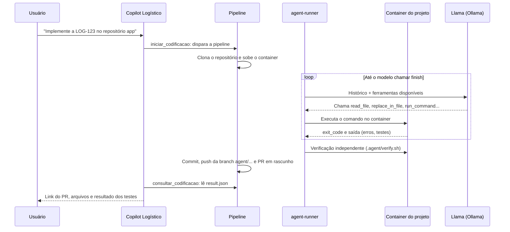

# Copilot Logístico: agente de codificação via pipeline (MVP da POC)

Este repositório transforma um pedido feito ao Copilot Logístico em um pull request.
O assistente dispara uma pipeline (Azure Pipelines ou GitHub Actions). A pipeline sobe um
ambiente Docker do projeto, roda um agente Java 17 com Spring AI conectado ao Llama (via Ollama),
que lê o código, edita, compila e testa em laço. No fim, a pipeline faz commit numa branch nova,
abre um PR em rascunho e publica um resultado que o assistente usa para responder ao usuário
com o link do PR, os arquivos alterados e o resultado dos testes.

## Como funciona



São três peças, e cada uma tem uma responsabilidade só:

| Peça | Onde roda | O que faz |
| --- | --- | --- |
| `assistant-connector/` | Dentro do assistente que vocês já têm | Duas ferramentas novas para o Llama do assistente: `iniciar_codificacao` e `consultar_codificacao` |
| `pipelines/` | Azure Pipelines ou GitHub Actions | Clona o repositório, prepara o Docker, roda o agente, faz commit, push e PR |
| `agent-runner/` | Dentro da pipeline | O agente que codifica: o laço de pensar, agir e observar com Spring AI |

### Como o modelo "observa" a execução

Essa é a parte central. O `agent-runner` expõe ferramentas ao Llama com `@Tool` do Spring AI e
roda o laço manualmente (`internalToolExecutionEnabled(false)` + `ToolCallingManager`), em vez
de deixar o framework fazer tudo sozinho. Assim conseguimos contar iterações, impor limites e
registrar cada passo. Uma volta típica:

1. O modelo pede `run_command("mvn -o -q test")`.
2. O agente executa o comando **dentro do container** com `docker exec` e devolve ao modelo:
   ```
   exit_code=1 duracao_ms=8421
   [ERROR] CalculadoraTest.somaDoisNumeros:14 expected: <5> but was: <-1>
   ```
3. Na próxima chamada, o modelo lê essa saída, abre o arquivo com `read_file`, corrige com
   `replace_in_file` e roda os testes de novo.
4. Quando vê `exit_code=0`, chama `finish("done", "resumo...")`.

Depois do laço, o agente roda **por conta própria** o `.agent/verify.sh` do repositório. Esse
resultado vai para o PR, então o revisor não depende do que o modelo afirmou.

Ferramentas disponíveis ao modelo (em `agent-runner/.../tools/CodingTools.java`):

| Ferramenta | Para quê |
| --- | --- |
| `list_files` | Ver a estrutura do projeto |
| `read_file` | Ler um arquivo com número de linha, inteiro ou por intervalo |
| `search_code` | Procurar por regex no repositório |
| `replace_in_file` | Editar um trecho exato (precisa ser único no arquivo) |
| `write_file` | Criar ou reescrever um arquivo |
| `run_command` | Rodar build, testes e comandos de inspeção no container, com tempo limite |
| `finish` | Encerrar com `done` ou `incomplete` e um resumo para o revisor |

## Estrutura do repositório

```
coding-agent-poc/
├── agent-runner/                 # Spring Boot (sem web), Java 17, Spring AI 1.1 + Ollama
│   └── src/main/java/.../agent/
│       ├── AgentRunnerApplication.java   # ponto de entrada da pipeline
│       ├── loop/CodingAgent.java         # o laço do agente
│       ├── tools/CodingTools.java        # as ferramentas @Tool
│       └── core/                         # Workspace, executores local e Docker, diário, resultado
├── assistant-connector/          # Código para plugar no assistente existente
│   └── src/main/java/.../codingagent/
│       ├── CodingAgentTools.java         # @Tool iniciar_codificacao e consultar_codificacao
│       ├── CodingTaskService.java        # gera id e branch, dispara, interpreta o resultado
│       └── pipeline/                     # clientes Azure Pipelines e GitHub Actions
├── pipelines/
│   ├── azure-pipelines.yml
│   ├── github/coding-agent.yml
│   └── scripts/
│       ├── prepare-sandbox.sh            # sobe o container e corta a rede
│       └── gitops.py                     # clone, commit, push e PR (fora do alcance do modelo)
└── target-repo-template/         # O que cada repositório alvo precisa ter
    ├── AGENTS.md
    └── .agent/ (Dockerfile, setup.sh, verify.sh)
```

## Passo a passo no Azure DevOps

### 1. Suba este repositório

Crie um repositório no Azure Repos (por exemplo `coding-agent`) no **mesmo projeto** dos
repositórios que o agente vai alterar, e envie este código para ele.

### 2. Crie o grupo de variáveis

Em **Pipelines > Library > + Variable group**, crie `coding-agent` com:

| Variável | Exemplo | Secreta |
| --- | --- | --- |
| `OLLAMA_BASE_URL` | `http://ollama.interno:11434` | Sim |
| `OLLAMA_MODEL` | o modelo que o assistente já usa | Não |
| `SANDBOX_DEFAULT_IMAGE` | `maven:3.9-eclipse-temurin-17` (opcional) | Não |

O agente da pipeline precisa alcançar o Ollama. Se o Ollama só existe na rede interna, use um
pool próprio (Managed DevOps Pools ou agentes self-hosted na mesma rede) no lugar de
`vmImage: ubuntu-latest`. O Ollama não tem autenticação nativa: não o exponha na internet sem
um gateway na frente.

### 3. Crie a pipeline

**Pipelines > New pipeline > Azure Repos Git > coding-agent > Existing YAML file >
`/pipelines/azure-pipelines.yml`**. Salve sem rodar e anote o `definitionId` que aparece na URL.

### 4. Dê permissões à identidade da pipeline

A pipeline usa `System.AccessToken`, cuja identidade é
`<Projeto> Build Service (<organização>)`. Nos repositórios alvo
(**Project Settings > Repositories > app > Security**), conceda:

- **Contribute**, **Create branch** e **Contribute to pull requests**: Allow.
- Na branch `main` de cada repositório alvo, negue **Contribute** a essa identidade, para que
  ela só consiga escrever em branches novas (`agent/...`).

Mantenha as políticas da `main`: revisores obrigatórios e validação por build. O PR do agente
nasce como rascunho e só entra depois de aprovação humana.

> **Proteção de acesso a repositórios.** Se a configuração *Protect access to repositories in
> YAML pipelines* estiver ativa no projeto, o token só acessa repositórios declarados no YAML.
> Isso funciona como uma lista de repositórios permitidos, o que é desejável. Declare-os assim:
>
> ```yaml
> resources:
>   repositories:
>     - repository: app
>       type: git
>       name: MeuProjeto/app
> jobs:
>   - job: code
>     uses:
>       repositories: [app]
> ```

### 5. Prepare cada repositório alvo

Copie `target-repo-template/` para a raiz do repositório alvo e ajuste:

- `.agent/Dockerfile`: imagem com a stack do projeto (precisa ter `bash` e `timeout`).
- `.agent/setup.sh`: baixa dependências. Roda **com internet**, antes do agente.
- `.agent/verify.sh`: verificação final (build e testes). Roda **sem internet**, depois do agente.
- `AGENTS.md`: comandos exatos, convenções e o que não mexer. O agente lê isso no início.

Sem esses arquivos a pipeline ainda funciona, com a imagem padrão e sem verificação, mas os
resultados pioram bastante. Esse é o ponto que mais influencia a qualidade, como mostram
Repo2Run, Devin e Cursor.

### 6. Teste a pipeline manualmente

Rode a pipeline pela interface com parâmetros de teste. Para gerar o `taskB64`:

```bash
echo -n '{"issueKey":"LOG-1","title":"Criar endpoint GET /health","description":"Retornar {\"status\":\"UP\"}","acceptanceCriteria":["GET /health responde 200"]}' | base64 -w0
```

Ao final, confira o PR em rascunho e o artefato `agent-result` (`result.json`, `changes.patch`,
`journal.jsonl`).

## Passo a passo no GitHub Actions

1. Copie `pipelines/github/coding-agent.yml` para `.github/workflows/` deste repositório.
2. Em **Settings > Secrets and variables > Actions**, crie:
   - Secrets `OLLAMA_BASE_URL` e `TARGET_REPO_TOKEN` (GitHub App ou PAT fine-grained com
     *Contents: read and write* e *Pull requests: read and write* nos repositórios alvo).
   - Variables `OLLAMA_MODEL` e, opcionalmente, `SANDBOX_DEFAULT_IMAGE`.
3. Proteja a `main` dos repositórios alvo com revisão obrigatória.
4. Prepare os repositórios alvo como no passo 5 do Azure.

## Integrar ao assistente existente

O conector não depende de nada além de Spring, Spring AI (só as anotações) e Jackson, que o
assistente já tem.

1. Copie `assistant-connector/src/main/java/com/empresa/copilotlogistico/codingagent` para o
   projeto do assistente (ou instale como dependência com `mvn install`).
2. Acrescente a configuração de `assistant-connector/application-coding-agent.example.yml`.
   Para o Azure, o PAT da conta de serviço precisa só do escopo **Build (Read & Execute)**:
   quem escreve no repositório é a pipeline, não o assistente.
3. Registre as ferramentas no `ChatClient` do assistente, junto com as de Jira que vocês já têm
   (exemplo completo em `assistant-connector/ExemploIntegracao.java.txt`):

   ```java
   builder.defaultTools(jiraTools, codingAgentTools)
   ```

Exemplo de conversa:

> **Usuário:** Implementa a LOG-231 no repositório `roteirizador`.
>
> **Assistente** (chama `iniciar_codificacao`): Comecei a codificação da LOG-231. A branch será
> `agent/LOG-231-9f3a1c2b` e você pode acompanhar a execução neste link.
>
> **Usuário:** E aí, terminou?
>
> **Assistente** (chama `consultar_codificacao`): Terminou. O PR em rascunho está aqui, alterou
> `RotaService.java` e `RotaServiceTest.java`, e a verificação `mvn -o verify` passou.

`consultar_codificacao` baixa o artefato `agent-result` e devolve ao modelo do assistente o link
do PR, a lista de arquivos, o resultado da verificação, o resumo do agente e uma prévia do diff.
É assim que o assistente "oferece os arquivos" ao usuário.

## Rodar o agente localmente (desenvolvimento)

Útil para ajustar prompts e ferramentas sem esperar a pipeline. **Não use o executor local em
repositórios que você não confia**: ele roda comandos direto na sua máquina.

```bash
cd agent-runner && mvn -q package -DskipTests
cat > /tmp/task.json <<'EOF'
{"requestId":"dev1","issueKey":"LOG-1","title":"Criar endpoint GET /health",
 "description":"Retornar {\"status\":\"UP\"}","acceptanceCriteria":["GET /health responde 200"]}
EOF
OLLAMA_BASE_URL=http://localhost:11434 OLLAMA_MODEL=<seu-modelo> \
java -jar target/agent-runner.jar \
  --agent.workspace=/caminho/do/repo-alvo \
  --agent.task-file=/tmp/task.json \
  --agent.output-dir=/tmp/agent-output \
  --agent.executor=local
```

Para testar o isolamento completo localmente, rode `pipelines/scripts/prepare-sandbox.sh` com
`WORKSPACE_DIR` e `CONTAINER_NAME` e use `--agent.executor=docker --agent.container=<nome>`.
Esse também é o caminho para a opção "máquina do usuário": o mesmo agente, com o mesmo executor
Docker, rodando no computador de quem pediu.

## Segurança: o que fica isolado

| Risco | Como o MVP trata |
| --- | --- |
| Código gerado acessar a internet ou exfiltrar dados | Rede do container é desligada depois do `setup.sh` |
| Modelo usar o token de Git | O token só existe nos passos de clone e publish. O passo do agente não o recebe, e o clone não grava o token no `.git/config` |
| Modelo sair do repositório | Ferramentas de arquivo bloqueiam `../`, links simbólicos para fora e a pasta `.git` |
| Push direto na main | Push só para `agent/...`, PR sempre em rascunho, permissão negada na main |
| Laço infinito ou custo alto | Limite de iterações, de chamadas de ferramenta e de tempo por comando; timeout do job |
| Prompt injection na issue ou no código | Instruído no prompt de sistema e contido pelas barreiras acima (rede, token, escopo) |
| Auditoria | `journal.jsonl` com cada chamada de ferramenta, publicado como artefato e linkado no PR |

## O que foi testado e o que falta testar

Testado neste ambiente, sem Maven Central disponível:

- As classes de núcleo e ferramentas do agente compilam com `javac` (Java 21, alvo compatível
  com 17). Um teste de fumaça simulou os passos do modelo num projeto Java real: listar, ler,
  buscar, corrigir um bug, compilar, observar `exit_code=0` e um erro de compilação, bloquear
  `git push`, `../` e `.git`, respeitar timeout e orçamento, gravar `result.json` e o diário.
- O conector, de ponta a ponta, contra servidores falsos que imitam as APIs do Azure DevOps e do
  GitHub: disparo com parâmetros corretos, acompanhamento, download do artefato com redirecionamento
  sem cabeçalho de autenticação, e a resposta final ao modelo com PR, arquivos, testes e diff.
- `gitops.py` com um repositório Git local e uma API falsa: clone sem gravar token, sem alterações
  sem PR, commit e push da branch, PR em rascunho no Azure e no GitHub, `[WIP]` quando a
  verificação falha, e saídas de build ignoradas no commit.
- YAMLs válidos e scripts com sintaxe verificada.

Não testado aqui, e primeiro passo ao clonar:

- `mvn package` dos dois módulos e os testes JUnit. As assinaturas do Spring AI usadas em
  `CodingAgent.java` foram conferidas no código-fonte da versão 1.1.1, mas a compilação completa
  com Maven não pôde rodar neste ambiente.
- Uma execução real com o Llama e com Docker numa pipeline de verdade.

## Limitações conhecidas e próximos passos

- **Modelo.** Agentes de código exigem boa chamada de ferramentas e contexto longo. Modelos
  pequenos (como Llama 3.1 8B) costumam parar de chamar ferramentas ou repetir ações; o agente
  tenta reorientar o modelo duas vezes antes de desistir. Meçam a taxa de sucesso com o modelo
  atual e comparem com um modelo maior ou especializado em código, com suporte a tools no Ollama.
- **Contexto.** O padrão do Ollama é uma janela pequena; o `application.yml` já define
  `num-ctx: 32768`. Ajuste conforme a memória do servidor.
- **Estado do assistente.** O registro das tarefas está em memória. Para produção, persista em
  banco (requestId, usuário, issue, runId, status).
- **Aviso de conclusão.** O assistente consulta sob demanda. Um próximo passo é um service hook
  do Azure DevOps (ou webhook do GitHub) avisando o assistente ao fim da pipeline.
- **Ajustes pelo PR.** Reexecutar a pipeline passando os comentários do PR como tarefa, sobre a
  branch existente.
- **Identidade.** Trocar PAT por service principal ou managed identity do Entra ID; o cliente do
  Azure já aceita um fornecedor de token (`AzurePipelinesClient.bearer(...)`).
- **Tempo de preparo.** Publicar a imagem do agent-runner e a imagem de cada projeto num registry,
  em vez de compilar a cada execução.
