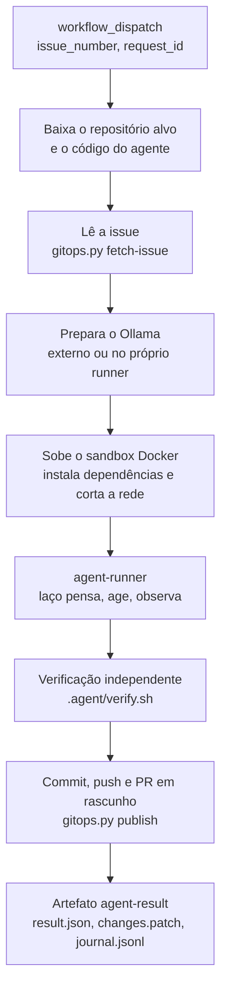
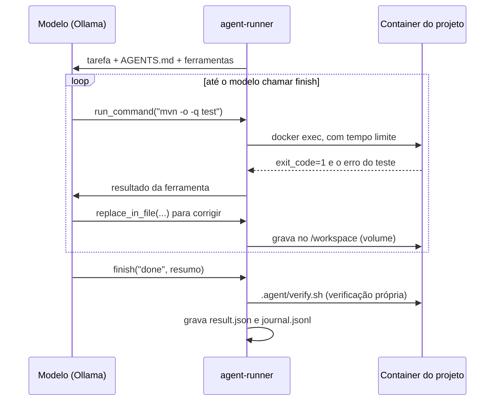

# coding-agent: agente de codificação no GitHub Actions

Um agente que recebe uma **issue**, trabalha num **container isolado** dentro do GitHub
Actions e devolve um **pull request em rascunho** para revisão humana. Ele é escrito em
Java 21 com Spring AI e usa um modelo servido pelo **Ollama**.

Quem abre a issue e dispara o agente é o assistente de chat
[`poc-websocket-demo`](https://github.com/CaioMC/poc-websocket-demo), com o comando
`/codificar`. Mas o agente não depende dele: qualquer pessoa pode abrir uma issue e rodar o
workflow à mão.

## Índice

1. [Em uma frase](#1-em-uma-frase)
2. [Como funciona](#2-como-funciona)
3. [O laço do agente: como o modelo observa a execução](#3-o-laço-do-agente-como-o-modelo-observa-a-execução)
4. [O que tem neste repositório](#4-o-que-tem-neste-repositório)
5. [Instalar o agente em um repositório](#5-instalar-o-agente-em-um-repositório)
6. [Onde o modelo roda](#6-onde-o-modelo-roda)
7. [Segurança](#7-segurança)
8. [Rodar localmente](#8-rodar-localmente)
9. [O que foi testado](#9-o-que-foi-testado)
10. [Limitações e próximos passos](#10-limitações-e-próximos-passos)

## 1. Em uma frase

**A issue é a tarefa, o GitHub Actions é o computador, o container é a mesa de trabalho
isolada e o PR em rascunho é a entrega.** Nenhum servidor próprio para manter e nenhum token
pessoal com permissão de push.

## 2. Como funciona

Cada repositório que quer usar o agente tem um workflow pequeno
(`.github/workflows/coding-agent.yml`) que chama o **workflow reutilizável** deste
repositório (`.github/workflows/agent.yml`). Como é chamado, ele roda no contexto do
repositório alvo e usa o `GITHUB_TOKEN` daquele repositório.



| Passo | Arquivo | Tem token de escrita? |
|---|---|---|
| Ler a issue e comentar "comecei" | `scripts/gitops.py fetch-issue` | Sim |
| Preparar o modelo | `scripts/setup-ollama.sh` | Não |
| Preparar o sandbox | `scripts/prepare-sandbox.sh` | Não |
| **Rodar o agente** | `agent-runner/` | **Não** |
| Commit, push, PR e comentário na issue | `scripts/gitops.py publish` | Sim |

## 3. O laço do agente: como o modelo observa a execução

O `agent-runner` oferece ferramentas ao modelo com `@Tool` do Spring AI e roda o laço
**manualmente** (`internalToolExecutionEnabled(false)` + `ToolCallingManager`). Assim
conseguimos contar as voltas, impor limites e registrar cada passo.



Ferramentas disponíveis (`tools/CodingTools.java`):

| Ferramenta | Para quê |
|---|---|
| `list_files` | Ver a estrutura do projeto |
| `read_file` | Ler um arquivo com número de linha, inteiro ou por intervalo |
| `search_code` | Procurar por regex no repositório |
| `replace_in_file` | Editar um trecho exato, que precisa ser único no arquivo |
| `write_file` | Criar ou reescrever um arquivo |
| `run_command` | Rodar build, testes e inspeções no container, com tempo limite |
| `finish` | Encerrar com `done` ou `incomplete` e um resumo para o revisor |

O ponto central é o `run_command`: o modelo nunca executa nada diretamente. Ele pede, o
agent-runner executa no container e devolve **o código de saída e o final da saída**. É lendo
isso que o modelo percebe um erro de compilação ou um teste falhando e decide o próximo passo.

Depois do laço, o workflow roda o `.agent/verify.sh` por conta própria. Esse resultado vai
para a descrição do PR, então o revisor não depende do que o modelo afirmou.

## 4. O que tem neste repositório

```
coding-agent/
├── .github/workflows/agent.yml       # workflow reutilizável (workflow_call)
├── agent-runner/                     # o agente: Spring Boot sem web, Java 21, Spring AI 1.1 + Ollama
│   └── src/main/java/com/example/codingagent/
│       ├── AgentRunnerApplication.java   # ponto de entrada
│       ├── loop/CodingAgent.java         # o laço do agente
│       ├── tools/CodingTools.java        # as ferramentas @Tool
│       ├── task/                         # a tarefa (vinda da issue)
│       └── core/                         # Workspace, executores local e Docker, diário, resultado
├── scripts/
│   ├── gitops.py                     # fetch-issue e publish (API do GitHub + git)
│   ├── setup-ollama.sh               # Ollama externo ou instalado no runner
│   └── prepare-sandbox.sh            # container do projeto, dependências, rede cortada
└── templates/target-repo/            # o que copiar para cada repositório alvo
    ├── .github/workflows/coding-agent.yml
    ├── .agent/ (Dockerfile, setup.sh, verify.sh)
    └── AGENTS.md
```

## 5. Instalar o agente em um repositório

1. **Copie os templates** de `templates/target-repo/` para a raiz do repositório alvo e ajuste:
   - `.agent/Dockerfile`: imagem com a stack do projeto (precisa ter `bash` e `timeout`);
   - `.agent/setup.sh`: baixa dependências. Roda **com internet**, antes do agente;
   - `.agent/verify.sh`: build e testes. Roda **sem internet**, depois do agente;
   - `AGENTS.md`: comandos exatos, arquitetura, convenções e o que não mexer.
2. **Libere o Actions para abrir PRs**: *Settings > Actions > General > Workflow
   permissions*, marque **Read and write permissions** e **Allow GitHub Actions to create
   and approve pull requests**.
3. **Opcional**: secret `OLLAMA_BASE_URL` e variáveis `CODING_AGENT_MODEL` e
   `CODING_AGENT_RUNNER` (ver seção 6).
4. **Teste à mão**: abra uma issue, depois *Actions > coding-agent > Run workflow*, com o
   número da issue, um `request_id` qualquer (ex.: `teste1`) e uma branch (ex.:
   `agent/teste1`). Ao final, confira o PR em rascunho, o comentário na issue e o artefato
   `agent-result`.

As linhas `- [ ] ...` no corpo da issue viram **critérios de aceite** para o agente.

O repositório [`poc-websocket-demo`](https://github.com/CaioMC/poc-websocket-demo) já vem
com esses arquivos e serve de exemplo completo.

## 6. Onde o modelo roda

| Opção | Configuração | Observação |
|---|---|---|
| Ollama no próprio runner (padrão) | Nenhuma | O workflow instala o Ollama e baixa `qwen3:4b`, com cache entre execuções. Em CPU: lento, bom para demonstrar |
| Ollama externo | Secret `OLLAMA_BASE_URL` | Um servidor com GPU. Coloque autenticação na frente: o Ollama não tem |
| Runner na sua máquina | Variável `CODING_AGENT_RUNNER=self-hosted` e secret `OLLAMA_BASE_URL=http://localhost:11434` | Usa seu Ollama e sua GPU. O runner precisa de Docker, Java 21 e Python 3 |

O modelo precisa ter suporte a **tools** no Ollama (ex.: `qwen3`, `llama3.1`). Modelos
pequenos se perdem em tarefas longas: o agente tenta reorientar o modelo duas vezes antes de
desistir, e para em `max_iterations` (padrão 30).

## 7. Segurança

| Risco | Como é tratado |
|---|---|
| Código gerado acessar a internet ou vazar dados | A rede do container é desligada depois do `setup.sh` |
| Modelo usar o token de Git | O token só aparece nos passos do `gitops.py`; o passo do agente não o recebe, e o checkout usa `persist-credentials: false` |
| Modelo sair do repositório | As ferramentas bloqueiam `../`, links simbólicos para fora e a pasta `.git` |
| Push direto na main | O agente só cria `agent/...`; o PR nasce em rascunho; proteja a `main` com revisão obrigatória |
| Laço infinito ou custo alto | Limites de iterações, de chamadas de ferramenta, de tempo por comando e do job (90 min) |
| Prompt injection na issue ou no código | Regras no prompt de sistema e, principalmente, as barreiras acima |
| Auditoria | `journal.jsonl` com cada chamada de ferramenta, no artefato `agent-result`, linkado no PR |

## 8. Rodar localmente

Útil para ajustar prompts e ferramentas sem esperar o Actions. Com `executor=local`, os
comandos rodam na sua máquina: use só em repositórios de confiança.

```bash
cd agent-runner && mvn -q package -DskipTests
cat > /tmp/task.json <<'EOF'
{"requestId":"dev1","issueNumber":1,"title":"Criar endpoint GET /api/health",
 "description":"Responder {\"status\":\"UP\"}","acceptanceCriteria":["GET /api/health responde 200"]}
EOF
OLLAMA_BASE_URL=http://localhost:11434 OLLAMA_MODEL=qwen3:4b \
java -jar target/agent-runner.jar \
  --agent.workspace=/caminho/do/repo-alvo \
  --agent.task-file=/tmp/task.json \
  --agent.output-dir=/tmp/agent-output \
  --agent.executor=local
```

Para o isolamento completo, rode antes `scripts/prepare-sandbox.sh` com `WORKSPACE_DIR` e
`CONTAINER_NAME`, e use `--agent.executor=docker --agent.container=<nome>`.

## 9. O que foi testado

Sem acesso ao Maven Central no ambiente em que isto foi escrito:

- **Núcleo do agente** (arquivos, executor, políticas, diário, resultado): compilado com
  `javac` e exercitado num projeto Java de verdade, simulando os passos do modelo: ler, buscar,
  corrigir um bug, compilar, observar `exit_code=0` e um erro, bloquear `git push`, `../` e
  `.git`, respeitar tempo limite e orçamento.
- **`gitops.py`** contra um repositório Git local e uma API do GitHub falsa: leitura da issue
  com critérios de aceite, commit, push, PR em rascunho com `Closes #N`, `[WIP]` quando a
  verificação falha, comentários na issue e saídas de build fora do commit.
- **YAML** dos workflows e sintaxe dos scripts.

**Não testado aqui**: `mvn package` com as dependências reais do Spring AI (as assinaturas
usadas em `CodingAgent.java` foram conferidas no código-fonte da versão 1.1.1) e uma execução
real no GitHub Actions. Esse é o primeiro teste a fazer.

## 10. Limitações e próximos passos

- **PR aberto com `GITHUB_TOKEN` não dispara outros workflows** (regra do GitHub contra
  loops). Se o repositório tem CI em PRs, use o token de um GitHub App no passo de publicação.
- **Desempenho no runner padrão.** CPU e modelo pequeno: bom para mostrar o fluxo, não para
  medir qualidade. Compare com um Ollama com GPU.
- **Janela de contexto.** O `application.yml` pede `num-ctx: 32768`; o histórico cresce a
  cada volta. Um próximo passo é resumir o histórico antigo.
- **Ajustes pelo PR.** Reexecutar o agente sobre a mesma branch a partir de um comentário.
- **Imagem pronta.** Publicar o agent-runner como imagem no GHCR para não compilar a cada execução.
