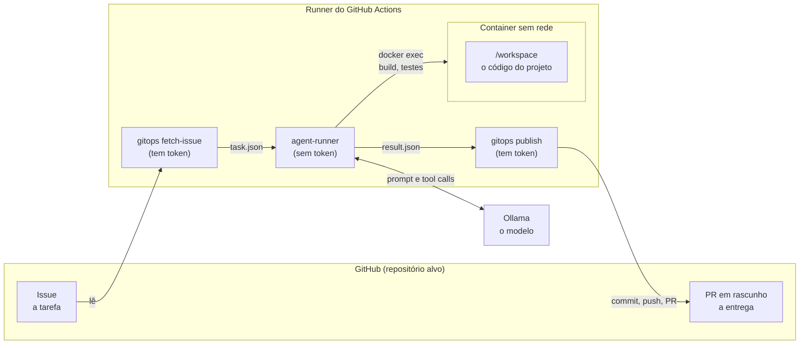

# coding-agent

Um agente de codificação que recebe uma **issue**, trabalha num **container isolado** dentro
do GitHub Actions e devolve um **pull request em rascunho** para revisão humana.

Eu construí este projeto para estudar, na prática, como um agente de código funciona por
dentro: como o modelo "enxerga" o resultado de um comando, como impedir que ele faça o que
não deve e como transformar isso numa pipeline que qualquer repositório pode usar. Ele é
escrito em Java 21 com Spring AI, usa um modelo servido pelo **Ollama**, e o código está
organizado em Clean Architecture.

## Índice

1. [Em uma frase](#1-em-uma-frase)
2. [Como as peças se encaixam](#2-como-as-peças-se-encaixam)
3. [Guia de leitura](#3-guia-de-leitura)
4. [O que tem neste repositório](#4-o-que-tem-neste-repositório)
5. [Instalar o agente em um repositório](#5-instalar-o-agente-em-um-repositório)
6. [Onde o modelo roda](#6-onde-o-modelo-roda)
7. [Segurança](#7-segurança)
8. [Rodar e testar localmente](#8-rodar-e-testar-localmente)
9. [Problemas que eu já encontrei](#9-problemas-que-eu-já-encontrei)
10. [Limitações e próximos passos](#10-limitações-e-próximos-passos)

## 1. Em uma frase

**A issue é a tarefa, o GitHub Actions é o computador, o container é a mesa de trabalho
isolada e o PR em rascunho é a entrega.**

Não há servidor próprio para manter, nem token pessoal com permissão de push.

## 2. Como as peças se encaixam



O ciclo do agente é **pensa, age, observa**:

1. o modelo recebe a tarefa e a lista de ferramentas (`read_file`, `run_command`...);
2. ele pede uma ferramenta, por exemplo `run_command("mvn -o -q test")`;
3. o agent-runner executa no container e devolve `exit_code=1` com o erro do teste;
4. o modelo lê o erro, corrige o arquivo e roda o teste de novo;
5. quando termina, chama `finish` com um resumo.

Depois disso, a pipeline roda a verificação do projeto por conta própria. Assim, o revisor
do PR não depende do que o modelo afirmou.

## 3. Guia de leitura

Eu separei a documentação por pergunta. Comece pelo que você quer entender:

| Quero entender... | Leia |
|---|---|
| O que cada step da pipeline faz, e como | [docs/pipeline.md](docs/pipeline.md) |
| Quem conversa com quem, em cada cenário (sucesso, erro, bloqueio, limite...) | [docs/sequencias.md](docs/sequencias.md) |
| Em que estado cada coisa está e o que a faz mudar | [docs/estados.md](docs/estados.md) |
| Como o código Java está organizado (camadas, classes, como estender) | [docs/arquitetura-java.md](docs/arquitetura-java.md) |
| O que o Python faz (classes, métodos, fluxos) | [docs/gitops-python.md](docs/gitops-python.md) |

Os diagramas são em [Mermaid](https://mermaid.js.org/), e o GitHub os renderiza direto na
página.

## 4. O que tem neste repositório

```
coding-agent/
├── .github/workflows/agent.yml        # a pipeline (workflow reutilizável)
├── agent-runner/                      # o agente, em Java 21 + Spring AI
│   └── src/main/java/com/example/codingagent/
│       ├── domain/                    #   regras puras: status final, política de comandos, orçamento
│       ├── application/               #   o caso de uso e as portas (interfaces)
│       └── infrastructure/            #   Spring AI, Docker, arquivos, JSON, configuração
├── scripts/
│   ├── gitops/                        # operações de GitHub com token (Python, só biblioteca padrão)
│   ├── tests/                         # testes do gitops
│   ├── setup-ollama.sh                # Ollama externo ou instalado no runner
│   └── prepare-sandbox.sh             # container do projeto, dependências, rede cortada
├── templates/target-repo/             # o que copiar para cada repositório alvo
│   ├── .github/workflows/coding-agent.yml
│   ├── .agent/ (Dockerfile, setup.sh, verify.sh)
│   └── AGENTS.md
└── docs/                              # a documentação com os diagramas
```

## 5. Instalar o agente em um repositório

1. **Copie os templates** de `templates/target-repo/` para a raiz do repositório alvo e ajuste:

   | Arquivo | Para quê | Quando roda |
   |---|---|---|
   | `.github/workflows/coding-agent.yml` | O gatilho que chama a pipeline deste repositório | No dispatch |
   | `.agent/Dockerfile` | A imagem com a stack do projeto (precisa ter `bash` e `timeout`) | Step 8 |
   | `.agent/setup.sh` | Baixa as dependências | Step 8, **com** internet |
   | `.agent/verify.sh` | Build e testes, a verificação independente | Step 9, **sem** internet |
   | `AGENTS.md` | Instruções para o agente: comandos exatos, convenções, o que não mexer | Vai no prompt |

2. **Libere o Actions para abrir PRs** no repositório alvo: *Settings → Actions → General →
   Workflow permissions*, marque **Allow GitHub Actions to create and approve pull requests**.
   Sem isso, o push funciona, mas o PR falha com `HTTP 403`.

3. **Opcional:** secret `OLLAMA_BASE_URL` e variáveis `CODING_AGENT_MODEL` e
   `CODING_AGENT_RUNNER` (veja a seção 6).

4. **Teste à mão:** abra uma issue e depois vá em *Actions → coding-agent → Run workflow*,
   com o número da issue, um `request_id` qualquer (ex.: `teste1`) e uma branch (ex.:
   `agent/teste1`). No fim, confira o PR em rascunho, o comentário na issue e o artefato
   `agent-result`.

Dica: escreva os critérios de aceite na issue como caixinhas (`- [ ] responde 200 em
/api/health`). Elas viram uma lista objetiva no prompt do agente.

O repositório [`poc-websocket-demo`](https://github.com/CaioMC/poc-websocket-demo) já tem
esses arquivos e serve de exemplo completo.

## 6. Onde o modelo roda

| Opção | Configuração | Quando usar |
|---|---|---|
| Ollama no próprio runner (padrão) | Nenhuma | Para demonstrar. Roda em **CPU**: cada resposta pode levar minutos |
| Ollama externo | Secret `OLLAMA_BASE_URL` | Uso real, com um servidor com GPU. Coloque autenticação na frente: o Ollama não tem |
| Runner na sua máquina | Variável `CODING_AGENT_RUNNER=self-hosted` e secret `OLLAMA_BASE_URL=http://localhost:11434` | Usar a sua GPU. A máquina precisa de Docker, Java 21 e Python 3 |

O modelo precisa suportar **tools** no Ollama (ex.: `qwen3`, `llama3.1`). O padrão é
`qwen3:4b`. Modelos pequenos se perdem em tarefas longas: o agente dá dois lembretes quando o
modelo para de usar ferramentas e para em `max_iterations` (padrão 30).

## 7. Segurança

A ideia central é: **quem conversa com o modelo não tem credencial, e quem tem credencial não
conversa com o modelo.**

| Risco | Como é tratado |
|---|---|
| Código gerado acessar a internet ou vazar dados | A rede do container é desligada depois do `setup.sh` |
| Modelo usar o token de Git | O token só aparece nos steps do `gitops`. O step do agente não o recebe, e o checkout usa `persist-credentials: false` |
| Modelo sair do repositório | O `SafePathResolver` barra `../`, links simbólicos para fora e a pasta `.git` |
| Modelo tentar fazer o papel da pipeline | A `CommandPolicy` bloqueia `git push`, `git commit`, `sudo` etc., com uma mensagem clara |
| Push direto na `main` | O agente só cria `agent/...` e o PR nasce em rascunho. Proteja a `main` com revisão obrigatória |
| Laço infinito ou custo alto | Limites de iterações, de chamadas de ferramenta, de tempo por comando e do job (90 min) |
| Prompt injection na issue ou no código | Regras no prompt de sistema e, principalmente, as barreiras acima |
| Auditoria | `journal.jsonl` com cada chamada de ferramenta, no artefato `agent-result` |

## 8. Rodar e testar localmente

### Testes

```bash
# Java: domínio, caso de uso, laço com modelo falso, barreiras de arquivo
cd agent-runner && mvn test

# Python: gitops contra uma API do GitHub falsa e um repositório Git real
python3 -m unittest discover -s scripts/tests -v

# Workflows: pega erros como contexto inválido antes do push
docker run --rm -v "$PWD:/repo" --workdir /repo rhysd/actionlint:latest
```

### Rodar o agente na sua máquina

Útil para ajustar prompts e ferramentas sem esperar o Actions. Com `executor=local`, os
comandos rodam direto na sua máquina: use só em repositórios de confiança.

```bash
cd agent-runner && mvn -q package -DskipTests
cat > /tmp/task.json <<'EOF'
{"requestId":"dev1","issueNumber":1,"title":"Criar endpoint GET /api/health",
 "description":"Responder {\"status\":\"UP\"}","acceptanceCriteria":["GET /api/health responde 200"]}
EOF
OLLAMA_BASE_URL=http://localhost:11434 OLLAMA_MODEL=qwen3:4b \
java -jar target/agent-runner.jar \
  --agent.workspace=/caminho/do/repo-alvo \
  --agent.task-file=/tmp/task.json \
  --agent.output-dir=/tmp/agent-output \
  --agent.executor=local
```

Para ter o isolamento completo, rode antes o `scripts/prepare-sandbox.sh` com `WORKSPACE_DIR`
e `CONTAINER_NAME`, e use `--agent.executor=docker --agent.container=<nome>`.

## 9. Problemas que eu já encontrei

### `HTTP 422 ... Unrecognized named-value: 'runner'` ao disparar

O GitHub recusou o workflow antes de rodar qualquer coisa. Eu tinha usado `${{ runner.temp }}`
no `env:` do job, mas o contexto `runner` só existe dentro dos steps. Corrigi definindo os
caminhos num step, via `$GITHUB_ENV` (step 0 em [docs/pipeline.md](docs/pipeline.md)).
O `actionlint` pega esse tipo de erro na hora.

### A execução parece travada em "Iteração 1 de 30"

Quase sempre não está travada: é o modelo pensando **em CPU**. O primeiro prompt é grande
(instruções, `AGENTS.md`, a issue e a descrição das sete ferramentas), o `qwen3` gera um
raciocínio longo antes de responder, e o log só mostra algo quando a resposta chega. Cada
iteração pode levar vários minutos no `ubuntu-latest`. Para acelerar, use um Ollama com GPU
(seção 6).

Se o Ollama estiver realmente fora do ar, o Spring AI tenta de novo várias vezes, esperando
cada vez mais, antes de desistir com status `ERROR`.

### `HTTP 403 ... GitHub Actions is not permitted to create or approve pull requests`

O agente terminou, o push da branch funcionou, mas o GitHub não deixou o `GITHUB_TOKEN` abrir
o PR. Habilite a opção do item 2 da seção 5 no repositório alvo. Para não perder a execução,
abra o PR à mão a partir da branch `agent/...`, que já está no GitHub.

## 10. Limitações e próximos passos

- **Falhas silenciosas na issue.** Se o agente termina com `ERROR` ou o PR é recusado, a issue
  fica só com o comentário "comecei". O motivo está no log e no artefato.
- **PR aberto com `GITHUB_TOKEN` não dispara outros workflows** (regra do GitHub contra loops).
  Se o repositório tem CI em PRs, use o token de um GitHub App no step de publicação.
- **Desempenho no runner padrão.** CPU e modelo pequeno servem para mostrar o fluxo, não para
  medir qualidade.
- **Janela de contexto.** O histórico cresce a cada volta, e o `num-ctx` padrão é 32768.
  Um próximo passo é resumir o histórico antigo.
- **Ajustes pelo PR.** Rodar o agente de novo sobre a mesma branch a partir de um comentário.
- **Imagem pronta.** Publicar o agent-runner no GHCR para não compilar a cada execução.
