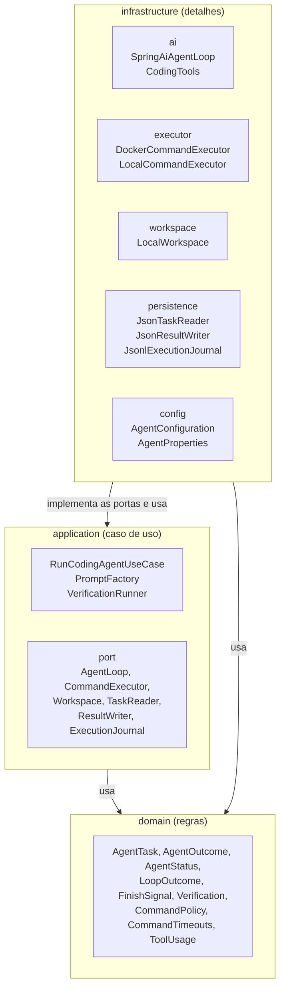
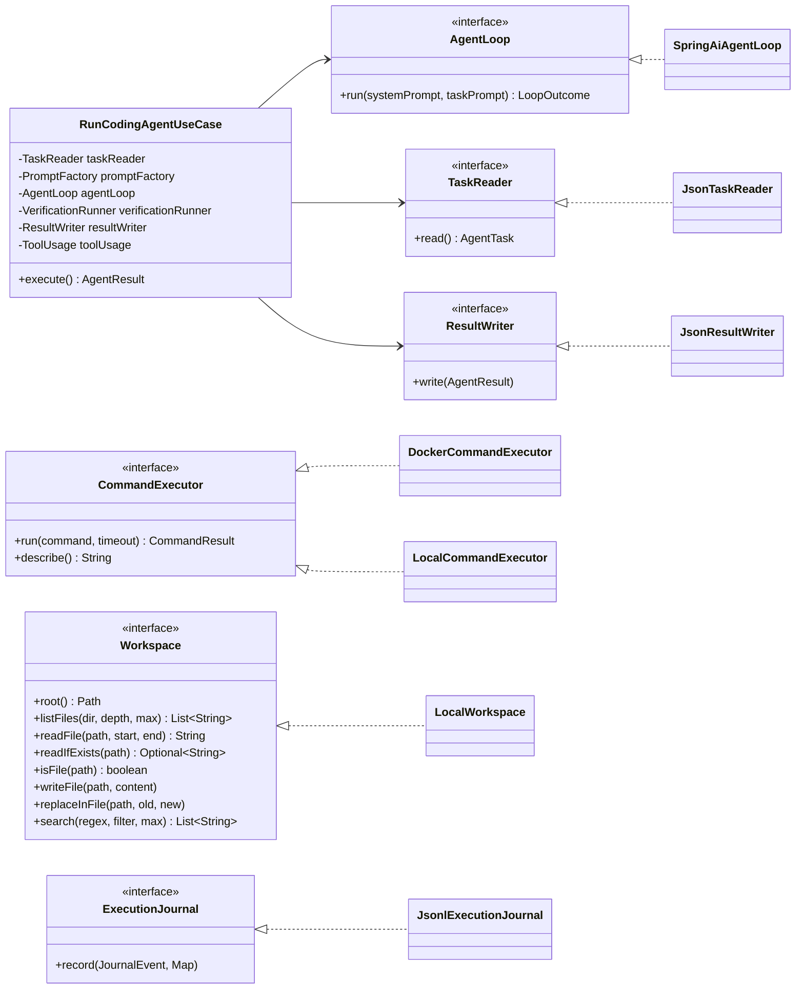
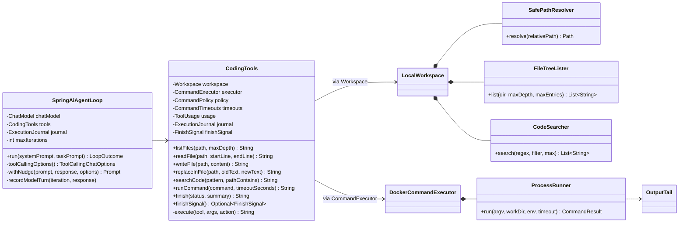
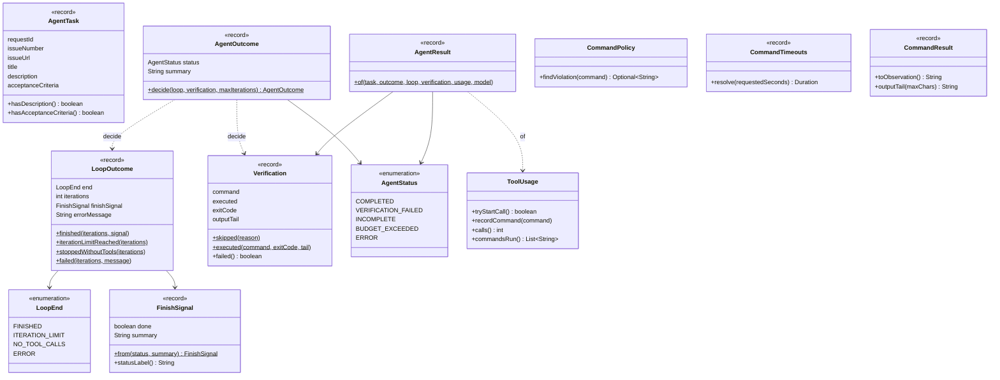
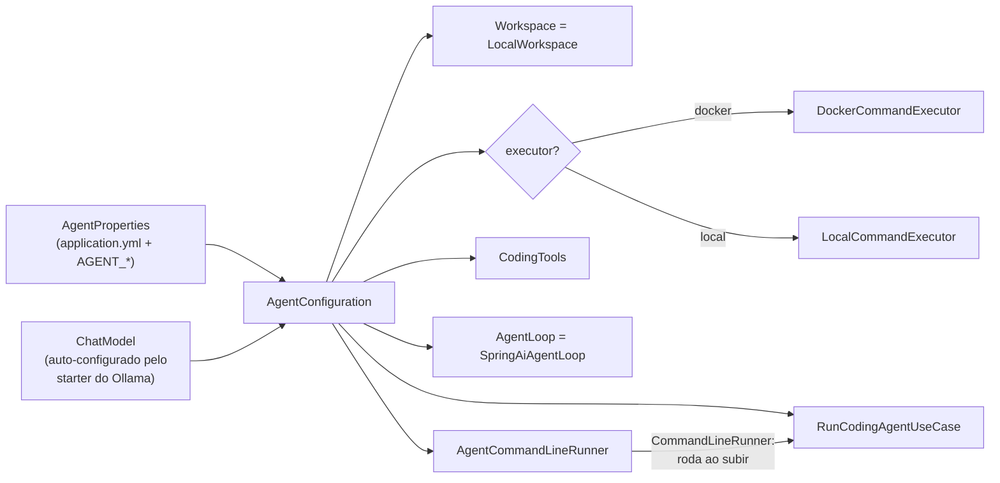

# Arquitetura do agent-runner (Java)

O `agent-runner` é o programa que conversa com o modelo e executa as ferramentas. Eu o
organizei em **Clean Architecture**: as regras ficam no centro, e os detalhes (Spring AI,
Docker, arquivos, JSON) ficam na borda. Aqui eu explico como as camadas funcionam, o que cada
classe faz e como estender o projeto.

## Índice

1. [A ideia em uma imagem](#1-a-ideia-em-uma-imagem)
2. [As três camadas](#2-as-três-camadas)
3. [Portas e adaptadores](#3-portas-e-adaptadores)
4. [O domínio](#4-o-domínio)
5. [Cada classe, em uma linha](#5-cada-classe-em-uma-linha)
6. [Como o Spring monta tudo](#6-como-o-spring-monta-tudo)
7. [Convenções de código](#7-convenções-de-código)
8. [Como estender](#8-como-estender)
9. [Testes](#9-testes)

## 1. A ideia em uma imagem



**A regra de ouro: as setas só apontam para dentro.** O domínio não conhece ninguém. A
aplicação conhece o domínio. A infraestrutura conhece as duas. Nunca o contrário.

## 2. As três camadas

| Camada | Pacote | Pergunta que responde | Depende de |
|---|---|---|---|
| Domínio | `domain` | **Quais são as regras?** Qual o status final? Esse comando é permitido? Ainda há orçamento? | Nada (só Java) |
| Aplicação | `application` | **Em que ordem as coisas acontecem?** Ler a tarefa, rodar o laço, verificar, gravar | Domínio |
| Infraestrutura | `infrastructure` | **Como, tecnicamente?** Spring AI, `docker exec`, arquivos, Jackson | Aplicação e domínio |

Por que isso importa num projeto pequeno como este:

- **Testar sem modelo.** O `AgentOutcome` decide o status sem Ollama nenhum. O
  `RunCodingAgentUseCase` é testado com lambdas no lugar do laço e do leitor de tarefa.
- **Trocar peças sem mexer no meio.** Trocar Docker por Kubernetes é escrever um novo
  `CommandExecutor`. Trocar o Spring AI por outra biblioteca é escrever um novo `AgentLoop`.
- **Ler o projeto por camadas.** Quem quer entender as regras lê só `domain`, que não tem
  nenhuma dependência de framework.

## 3. Portas e adaptadores

Uma **porta** é uma interface que a aplicação define dizendo "eu preciso de alguém que faça
isso". Um **adaptador** é a classe da infraestrutura que faz de verdade.



E como as ferramentas do modelo se ligam a tudo isso:



## 4. O domínio

O domínio são objetos simples, a maioria `record`, com as regras que não dependem de
tecnologia.



O método mais importante do domínio é o `AgentOutcome.decide()`. Ele é a tabela de decisão
do status final, desenhada em [estados.md](estados.md#3-a-decisão-do-status-final).

## 5. Cada classe, em uma linha

### `domain`

| Classe | O que faz |
|---|---|
| `AgentTask` | A tarefa vinda da issue. Recusa tarefa sem título |
| `AgentStatus` | Os cinco status finais possíveis |
| `AgentOutcome` | Decide o status e o resumo a partir do laço e da verificação |
| `AgentResult` | O que vai para o `result.json` |
| `LoopOutcome` / `LoopEnd` | Como o laço terminou e em qual iteração |
| `FinishSignal` | O que o modelo disse ao chamar `finish` (`done` ou `incomplete`, e o resumo) |
| `Verification` | O resultado do `verify.sh`, ou o motivo de não ter rodado |
| `ToolUsage` | Conta as chamadas de ferramenta e guarda os comandos executados |
| `CommandPolicy` | Diz se um comando é proibido e por quê |
| `CommandTimeouts` | Aplica o tempo limite padrão e o máximo a um pedido do modelo |
| `CommandResult` | Código de saída e saída de um comando, e como mostrar isso ao modelo |

### `application`

| Classe | O que faz |
|---|---|
| `RunCodingAgentUseCase` | O roteiro: ler tarefa, rodar laço, verificar, decidir, gravar |
| `PromptFactory` | Monta o prompt de sistema (com `AGENTS.md`) e o prompt da tarefa |
| `VerificationRunner` | Escolhe e roda o comando de verificação |
| `port.*` | As interfaces que a infraestrutura implementa |
| `port.JournalEvent` | Os tipos de evento do `journal.jsonl` (`model_turn`, `tool_call`...) |

### `infrastructure`

| Pacote | Classe | O que faz |
|---|---|---|
| `ai` | `SpringAiAgentLoop` | O laço pensa, age, observa com o Spring AI |
| `ai` | `CodingTools` | As sete ferramentas `@Tool` que o modelo pode chamar |
| `executor` | `DockerCommandExecutor` | Roda comandos com `docker exec` e `timeout` dentro do container |
| `executor` | `LocalCommandExecutor` | Roda comandos com `bash` local (desenvolvimento) |
| `executor` | `ProcessRunner` | Inicia o processo, espera, mata se passar do tempo |
| `executor` | `OutputTail` | Guarda só o final da saída (o erro costuma estar no fim) |
| `workspace` | `LocalWorkspace` | Lê, escreve e edita arquivos do repositório |
| `workspace` | `SafePathResolver` | Barra caminhos fora da raiz, links para fora e `.git` |
| `workspace` | `FileTreeLister` | Lista a árvore de arquivos, pulando `target`, `node_modules`... |
| `workspace` | `CodeSearcher` | Busca por regex linha a linha |
| `workspace` | `IgnoredDirectories` | A lista de pastas ignoradas |
| `persistence` | `JsonTaskReader` | Lê o `task.json` |
| `persistence` | `JsonResultWriter` | Grava o `result.json` |
| `persistence` | `JsonlExecutionJournal` | Acrescenta uma linha JSON por evento no `journal.jsonl` |
| `config` | `AgentProperties` | As configurações `agent.*` (vêm das variáveis `AGENT_*`) |
| `config` | `AgentConfiguration` | Cria e liga todos os objetos |
| `config` | `AgentCommandLineRunner` | Roda o caso de uso e define o código de saída |

## 6. Como o Spring monta tudo

Só a `AgentConfiguration` conhece todas as classes concretas. Ela é o único lugar que diz
"a porta `CommandExecutor` é um `DockerCommandExecutor`".



O `AgentRunnerApplication.main` sobe o Spring, o `AgentCommandLineRunner` roda uma vez, e o
`SpringApplication.exit` usa o código de saída dele (`ExitCodeGenerator`).

## 7. Convenções de código

Estas são as regras que eu segui. Se for contribuir, siga as mesmas:

- **`this.` sempre que possível.** Em todo acesso a campo e chamada de método da própria
  instância. Assim fica claro, sem olhar a assinatura, o que é estado do objeto e o que é
  variável local.
- **Poucos comentários.** O nome da classe e do método deve explicar o que ele faz. Comentário
  só para o **porquê** que não dá para ver no código (ex.: por que o `timeout` roda dentro do
  container). A explicação longa mora aqui em `docs/`.
- **Métodos pequenos com nome de intenção.** Ex.: `SafePathResolver.resolve()` chama
  `ensureInsideRoot`, `ensureNoSymlinkEscape` e `ensureOutsideGitDirectory`.
- **`record` para dados, factory methods com nome.** `LoopOutcome.finished(...)` diz mais que
  `new LoopOutcome(LoopEnd.FINISHED, ..., null)`.
- **`Optional` no lugar de `null` em retornos.** Ex.: `CommandPolicy.findViolation()`.
- **Mensagens para o modelo em português e acionáveis.** "Trecho não encontrado... Leia o
  arquivo de novo e copie o trecho exatamente" ensina o modelo a sair do erro.

## 8. Como estender

### Adicionar uma ferramenta nova

1. Crie um método público em `CodingTools` com `@Tool(name = ..., description = ...)` e
   parâmetros com `@ToolParam`. A descrição é o que o modelo lê: seja específico.
2. Envolva o corpo em `this.execute("nome", args, () -> ...)`. Assim a ferramenta ganha, de
   graça, orçamento, captura de erros e registro no diário.
3. Se a ferramenta precisa de algo novo do "mundo" (ex.: rede, banco), crie uma **porta** em
   `application.port` e o adaptador em `infrastructure`.
4. Mencione a ferramenta no prompt de sistema (`PromptFactory`) se ela mudar o método de
   trabalho.

### Trocar onde os comandos rodam

Implemente `CommandExecutor` (ex.: `KubernetesCommandExecutor`), adicione um valor em
`ExecutorType` e um `case` na `AgentConfiguration.commandExecutor()`. Nada mais muda.

### Trocar o provedor do modelo

Troque o starter no `pom.xml` (ex.: `spring-ai-starter-model-openai` para um endpoint
compatível com OpenAI). O `SpringAiAgentLoop` usa só a interface `ChatModel`, então continua
igual.

## 9. Testes

```bash
cd agent-runner
mvn test
```

| Teste | Camada | O que garante |
|---|---|---|
| `AgentOutcomeTest` | domínio | Os cinco status finais |
| `CommandPolicyTest` | domínio | Build e testes passam, push, commit, sudo e `rm -rf /` são barrados |
| `ToolUsageTest` | domínio | Orçamento de chamadas e limites de tempo |
| `RunCodingAgentUseCaseTest` | aplicação | Ordem do roteiro, verificação mesmo com erro, `AGENTS.md` no prompt |
| `SpringAiAgentLoopTest` | infraestrutura | O laço com um modelo falso: finish, lembretes, limites, erro |
| `LocalWorkspaceTest` | infraestrutura | Barreiras de caminho, leitura numerada, edição única, busca |

O `SpringAiAgentLoopTest` merece destaque: ele usa um `ChatModel` falso que devolve respostas
roteirizadas. Com isso, dá para testar o laço **inteiro**, incluindo o `ToolCallingManager` de
verdade chamando as ferramentas de verdade, sem nenhum modelo rodando.
