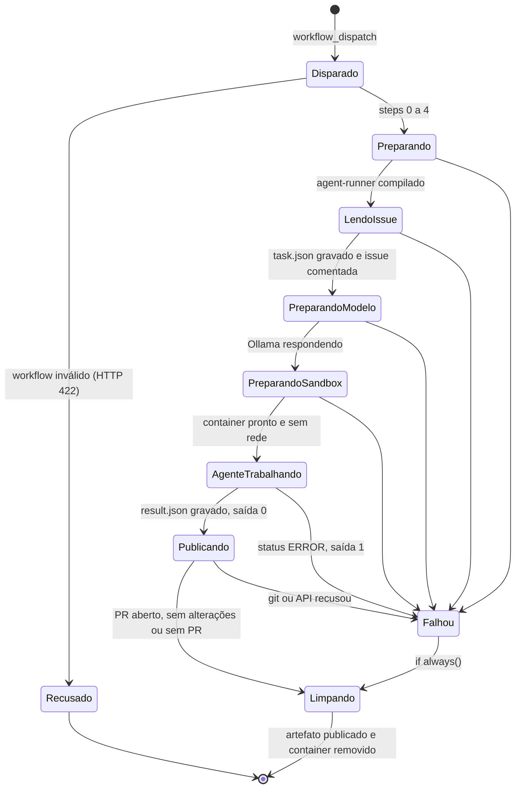
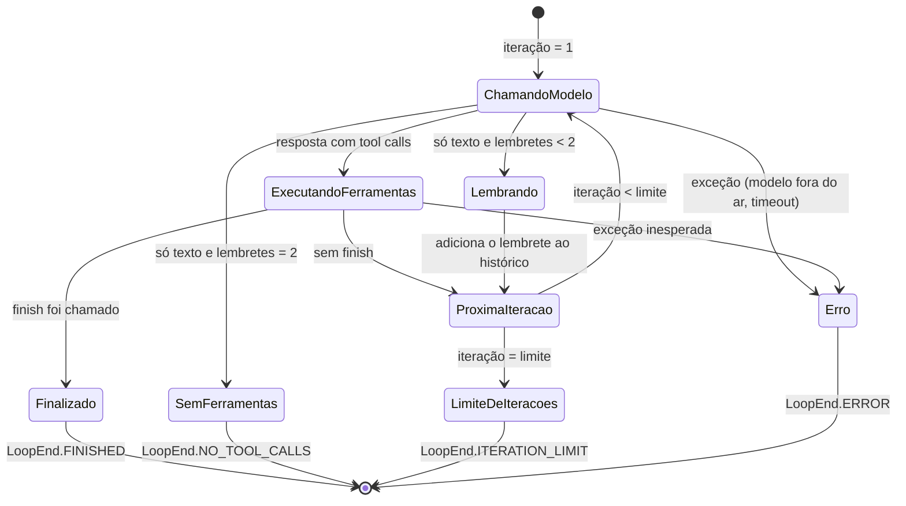
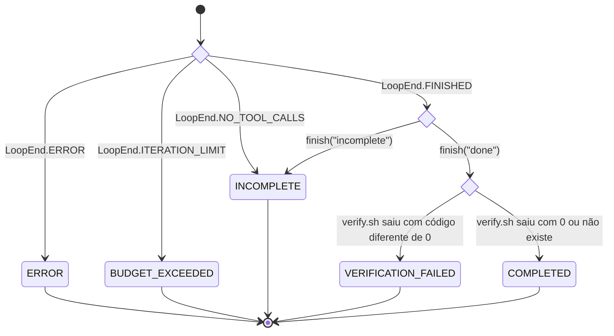
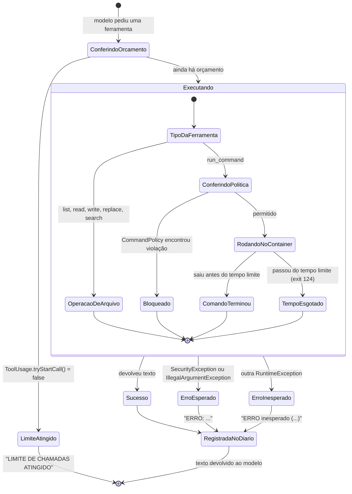
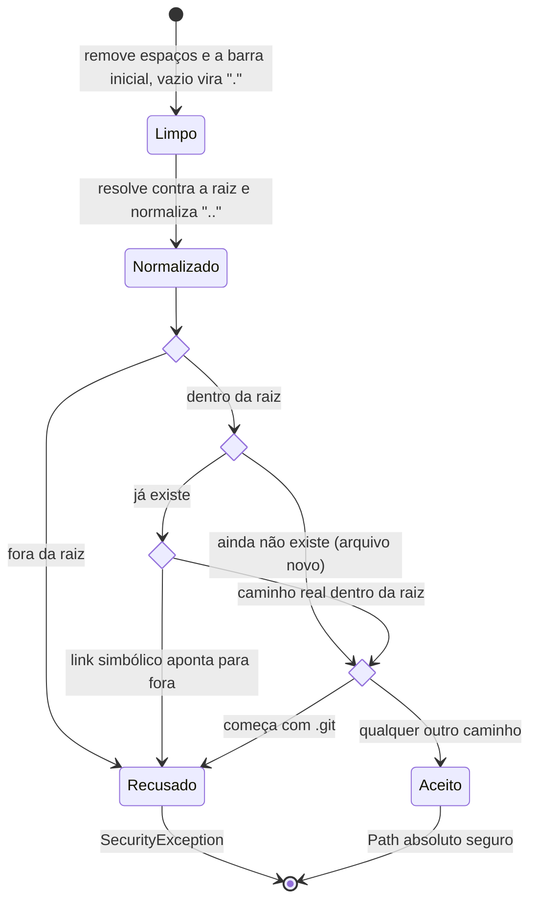
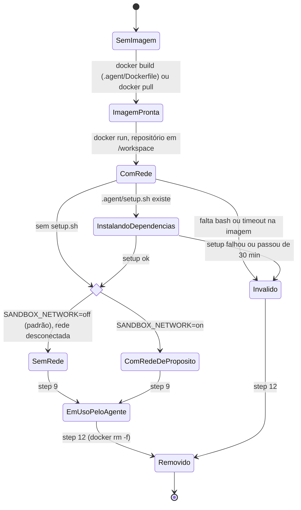
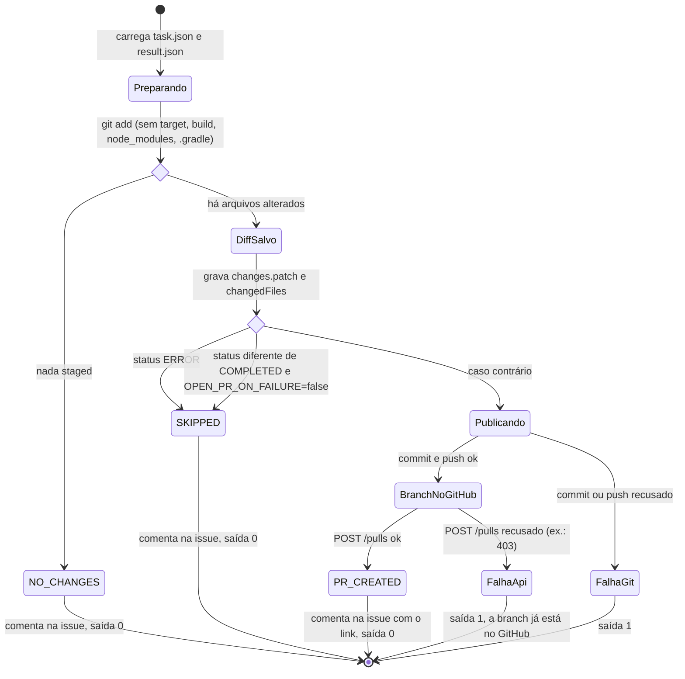
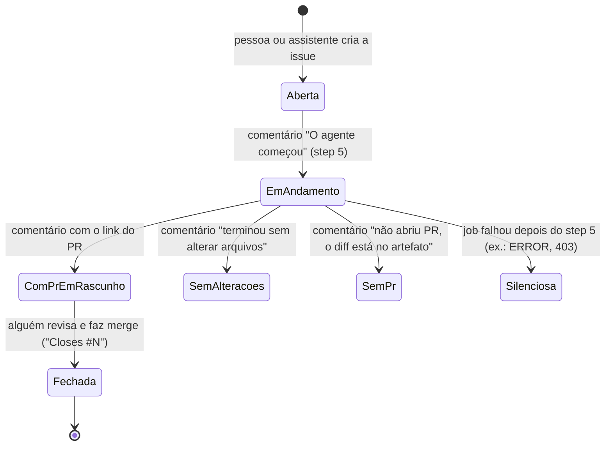

# Diagramas de estado

O diagrama de sequência responde "quem fala com quem". O diagrama de estado responde outra
pergunta: **em que situação a coisa está agora, e o que a faz mudar de situação?** Eu usei um
diagrama por "coisa": a execução, o laço, uma chamada de ferramenta, o container, a
publicação e a issue.

Cada estado final aqui tem um teste automatizado correspondente. A tabela no fim diz qual.

## Índice

1. [A execução inteira (job)](#1-a-execução-inteira-job)
2. [O laço do agente](#2-o-laço-do-agente)
3. [A decisão do status final](#3-a-decisão-do-status-final)
4. [Uma chamada de ferramenta](#4-uma-chamada-de-ferramenta)
5. [Um caminho vindo do modelo](#5-um-caminho-vindo-do-modelo)
6. [O container sandbox](#6-o-container-sandbox)
7. [Publicação (PublishCommand)](#7-publicação-publishcommand)
8. [A issue, vista por quem pediu](#8-a-issue-vista-por-quem-pediu)
9. [Onde cada estado é testado](#9-onde-cada-estado-é-testado)

---

## 1. A execução inteira (job)

## 2. O laço do agente

Este é o `SpringAiAgentLoop.run()`. Os contadores são `iteração` (quantas vezes o modelo foi
chamado) e `lembretes` (quantas vezes o modelo respondeu sem ferramenta).

## 3. A decisão do status final

Depois do laço, o `AgentOutcome.decide()` junta o `LoopOutcome` com a `Verification` e decide
o status que vai para o `result.json`. Os losangos são decisões.

O que cada status significa para quem vai revisar:

| Status | Significado | Título do PR | Código de saída |
|---|---|---|---|
| `COMPLETED` | Terminou e a verificação passou (ou não havia verificação) | `título da issue` | 0 |
| `VERIFICATION_FAILED` | O modelo disse que terminou, mas o `verify.sh` falhou | `[WIP] título` | 0 |
| `INCOMPLETE` | O modelo desistiu ou parou de usar ferramentas | `[WIP] título` | 0 |
| `BUDGET_EXCEEDED` | Chegou ao limite de iterações | `[WIP] título` | 0 |
| `ERROR` | O laço quebrou (ex.: modelo indisponível) | sem PR | 1 |

## 4. Uma chamada de ferramenta

Toda ferramenta, exceto `finish`, passa pelo `CodingTools.execute()`. O `run_command` tem uma
etapa a mais: a política de comandos.

O ponto principal: **nenhum desses caminhos derruba o agente**. Todos terminam com um texto
que volta para o modelo.

## 5. Um caminho vindo do modelo

O `SafePathResolver.resolve()` é uma sequência de barreiras. Se o caminho passar por todas,
vira um `Path` seguro.

## 6. O container sandbox

`ComRedeDeProposito` existe só para depuração. Nunca use com código que você não confia.

## 7. Publicação (PublishCommand)

O `publish` grava o resultado no campo `publish.state` do `result.json`.

## 8. A issue, vista por quem pediu

`Silenciosa` é a limitação que eu comentei em [pipeline.md](pipeline.md#6-o-que-acontece-quando-um-step-falha):
nesses casos, o motivo está no log do job e no artefato `agent-result`, não na issue.

## 9. Onde cada estado é testado

| Diagrama | Estado | Teste |
|---|---|---|
| 2. Laço | `FINISHED` | `SpringAiAgentLoopTest.terminaQuandoOModeloChamaFinish` |
| 2. Laço | `Lembrando` e depois `FINISHED` | `SpringAiAgentLoopTest.lembreteSemFerramentaRetomaOTrabalho` |
| 2. Laço | `NO_TOOL_CALLS` | `SpringAiAgentLoopTest.desisteDepoisDeDuasRespostasSemFerramentas` |
| 2. Laço | `ITERATION_LIMIT` | `SpringAiAgentLoopTest.paraNoLimiteDeIteracoes` |
| 2. Laço | `ERROR` | `SpringAiAgentLoopTest.falhaDoModeloViraErro` |
| 3. Status | os cinco status | `AgentOutcomeTest` (um teste por status) |
| 3. Status | verificação roda mesmo com `ERROR` | `RunCodingAgentUseCaseTest.verificacaoRodaMesmoQuandoOLacoFalha` |
| 4. Ferramenta | `Bloqueado` | `SpringAiAgentLoopTest.comandoBloqueadoNaoChegaAoExecutor`, `CommandPolicyTest` |
| 4. Ferramenta | `LimiteAtingido` | `ToolUsageTest.recusaChamadasAlemDoLimite` |
| 5. Caminho | fora da raiz, link, `.git` | `LocalWorkspaceTest` |
| 7. Publicação | `PR_CREATED` | `test_gitops.PublishTest.test_abre_pr_em_rascunho_quando_concluido` |
| 7. Publicação | `[WIP]` | `test_gitops.PublishTest.test_prefixo_wip_quando_verificacao_falha` |
| 7. Publicação | `NO_CHANGES` | `test_gitops.PublishTest.test_sem_alteracoes_apenas_comenta` |
| 7. Publicação | `SKIPPED` | `test_gitops.PublishTest.test_status_error_guarda_patch_e_nao_abre_pr` |
| 7. Publicação | `FalhaApi` | `test_gitops.PublishTest.test_falha_ao_criar_pr_encerra_com_erro` |
