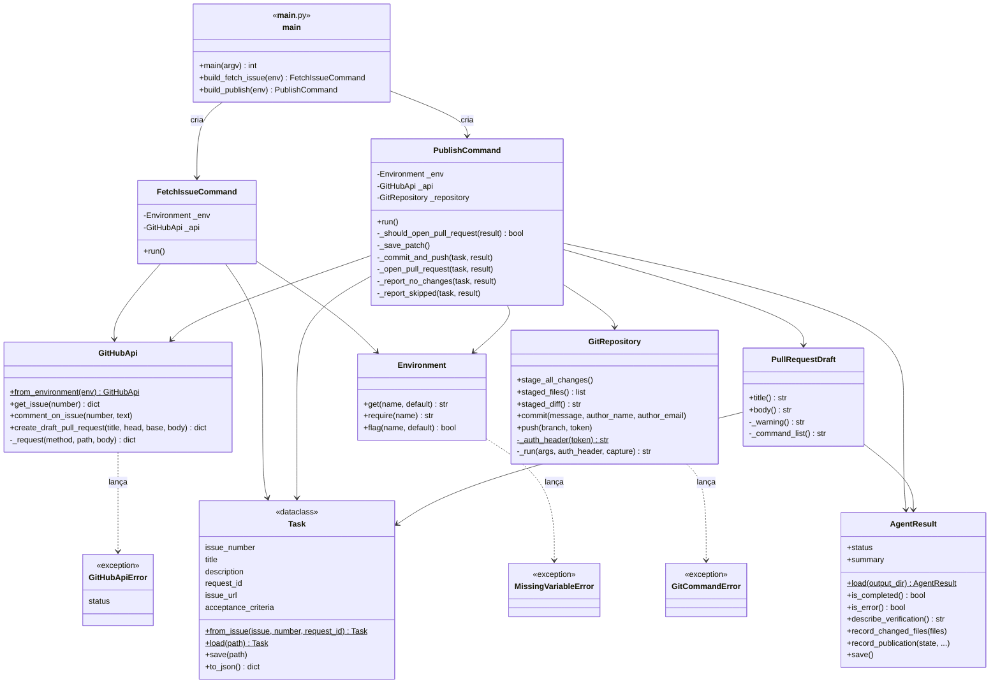
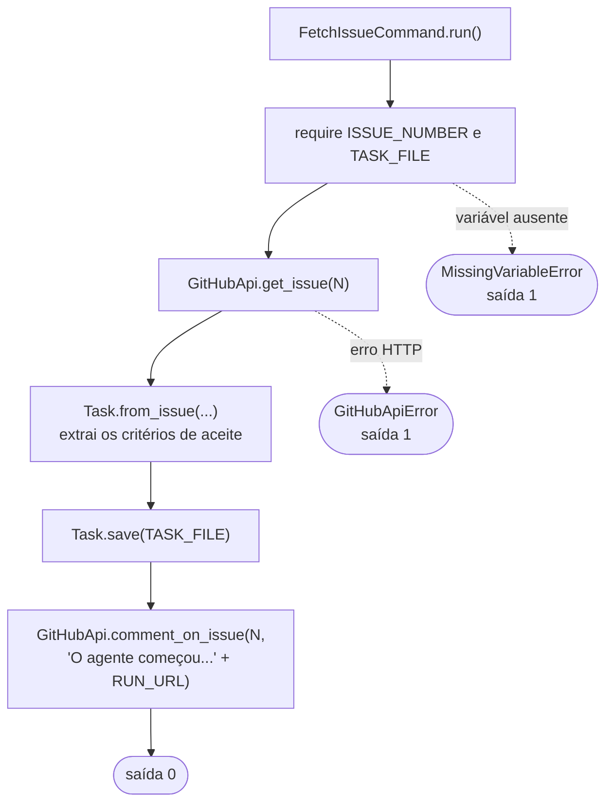
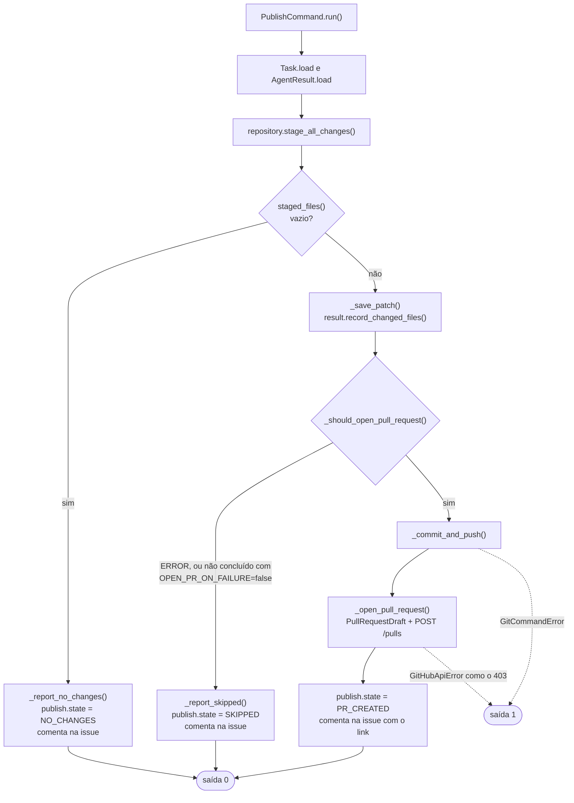

# gitops: as operações de GitHub (Python)

O `scripts/gitops` é a única parte do projeto que tem o token de escrita do GitHub. Ele roda
em dois momentos da pipeline:

- **`fetch-issue`** (step 5): lê a issue, grava o `task.json` e avisa na issue que começou.
- **`publish`** (step 10): faz commit, push, abre o PR em rascunho e comenta o resultado.

Eu escrevi em Python usando **só a biblioteca padrão**, porque ela já vem em todo runner do
GitHub. Não há `pip install`.

## Índice

1. [Por que separado do agente](#1-por-que-separado-do-agente)
2. [Estrutura do pacote](#2-estrutura-do-pacote)
3. [Diagrama de classes](#3-diagrama-de-classes)
4. [Cada classe e seus métodos](#4-cada-classe-e-seus-métodos)
5. [O fluxo de fetch-issue](#5-o-fluxo-de-fetch-issue)
6. [O fluxo de publish](#6-o-fluxo-de-publish)
7. [Variáveis de ambiente](#7-variáveis-de-ambiente)
8. [Testes](#8-testes)

## 1. Por que separado do agente

Se o mesmo processo que conversa com o modelo tivesse o token, um prompt malicioso dentro de
uma issue ou de um arquivo do repositório poderia tentar convencer o modelo a usá-lo. Separando:

- o **agent-runner** conversa com o modelo e **não tem token**;
- o **gitops** tem o token e **não conversa com o modelo**.

O `gitops` também é pequeno o suficiente para ser lido inteiro numa revisão de segurança.

## 2. Estrutura do pacote

```
scripts/gitops/
├── __main__.py        # ponto de entrada: escolhe o comando e trata os erros
├── environment.py     # Environment: lê variáveis de ambiente
├── console.py         # log(): imprime com o prefixo [gitops]
├── github_api.py      # GitHubApi: issues, comentários e PRs pela API REST
├── git_repository.py  # GitRepository: add, diff, commit e push
├── task.py            # Task: a tarefa (issue) e o task.json
├── agent_result.py    # AgentResult: lê e completa o result.json
├── pull_request.py    # PullRequestDraft: título e corpo do PR
├── fetch_issue.py     # FetchIssueCommand: o comando fetch-issue
└── publish.py         # PublishCommand: o comando publish
```

A pipeline chama a **pasta** diretamente, e o Python executa o `__main__.py`:

```bash
python3 scripts/gitops fetch-issue
python3 scripts/gitops publish
```

## 3. Diagrama de classes

Os dois comandos ficam no topo. Eles não falam com HTTP nem com `git` diretamente: pedem
para `GitHubApi` e `GitRepository`.



## 4. Cada classe e seus métodos

### `__main__.py`

| Função | O que faz |
|---|---|
| `main(argv)` | Confere o comando, cria o objeto certo e chama `run()`. Transforma `MissingVariableError`, `GitHubApiError` e `GitCommandError` numa mensagem no stderr e código de saída 1 |
| `build_fetch_issue(env)` | Monta o `FetchIssueCommand` com uma `GitHubApi` |
| `build_publish(env)` | Monta o `PublishCommand` com uma `GitHubApi` e um `GitRepository` apontando para `WORKSPACE_DIR` |

### `Environment`

| Método | O que faz |
|---|---|
| `get(name, default)` | Valor da variável, ou o padrão se ela não existir ou estiver vazia |
| `require(name)` | Valor da variável, ou `MissingVariableError` |
| `flag(name, default)` | `True` se o valor for `"true"` (sem diferenciar maiúsculas) |

Recebe um `dict` opcional no construtor. Isso facilita testes sem mexer no `os.environ`.

### `GitHubApi`

| Método | Chamada HTTP |
|---|---|
| `from_environment(env)` | Lê `GITHUB_API_URL`, `GH_TOKEN` e `GITHUB_REPOSITORY` |
| `get_issue(number)` | `GET /repos/{repo}/issues/{number}` |
| `comment_on_issue(number, text)` | `POST /repos/{repo}/issues/{number}/comments` |
| `create_draft_pull_request(...)` | `POST /repos/{repo}/pulls` com `draft: true` |
| `_request(...)` | Monta o pedido com os cabeçalhos do GitHub e transforma erro HTTP em `GitHubApiError` |

### `GitRepository`

| Método | Comando `git` |
|---|---|
| `stage_all_changes()` | `git add -A -- . ` excluindo `target/`, `build/`, `node_modules/` e `.gradle/` |
| `staged_files()` | `git diff --cached --name-status`, devolvendo só o caminho atual de cada arquivo |
| `staged_diff()` | `git diff --cached` (vira o `changes.patch`) |
| `commit(...)` | `git -c user.name=... -c user.email=... commit -q -m ...` |
| `push(branch, token)` | `git -c http.extraheader=... push origin HEAD:refs/heads/<branch>` |
| `_run(...)` | Executa, imprime o comando **com o token mascarado** e lança `GitCommandError` se falhar |

O token vai num cabeçalho HTTP passado com `-c`, que vale **só para aquele comando**. Ele
nunca é gravado no `.git/config`.

### `Task`

| Método | O que faz |
|---|---|
| `from_issue(issue, number, request_id)` | Cria a tarefa a partir do JSON da API, extraindo os critérios de aceite |
| `load(path)` / `save(path)` | Lê e grava o `task.json` (as chaves no JSON são camelCase, como o Java espera) |
| `parse_acceptance_criteria(body)` | Função do módulo: cada linha `- [ ] texto` ou `* [x] texto` vira um critério |

### `AgentResult`

Envolve o `result.json` que o agent-runner gravou.

| Método | O que faz |
|---|---|
| `load(output_dir)` | Lê o arquivo. Se não existir, finge um resultado `ERROR` |
| `status`, `summary`, `iterations`, `tool_calls`, `model`, `commands_run` | Leitura dos campos |
| `is_completed()` / `is_error()` | Atalhos para `COMPLETED` e `ERROR` |
| `describe_verification()` | Texto como `` `bash .agent/verify.sh` terminou com código 0 ✅ `` |
| `record_changed_files(files)` | Acrescenta `changedFiles` |
| `record_publication(**campos)` | Acrescenta `publish` (ex.: `state=PR_CREATED`) e grava o arquivo |

### `PullRequestDraft`

| Método | O que faz |
|---|---|
| `title()` | Título da issue, com `[WIP] ` na frente se o status não for `COMPLETED` |
| `body()` | `Closes #N`, aviso, resumo do agente, verificação, dados da execução e últimos comandos |

### `FetchIssueCommand` e `PublishCommand`

Os dois comandos estão detalhados nas seções 5 e 6.

## 5. O fluxo de fetch-issue



## 6. O fluxo de publish

O `PublishCommand.run()` lê como uma receita: cada passo é um método com nome de intenção.



A versão em diagrama de estados, com todos os estados finais, está em
[estados.md](estados.md#7-publicação-publishcommand).

## 7. Variáveis de ambiente

| Variável | Usada em | Quem define |
|---|---|---|
| `GITHUB_REPOSITORY` | os dois | GitHub Actions |
| `GITHUB_API_URL` | os dois | GitHub Actions (padrão `https://api.github.com`) |
| `GH_TOKEN` | os dois | Workflow (`github.token`) |
| `RUN_URL` | os dois | Workflow (link da execução) |
| `TASK_FILE` | os dois | Step 0 (`$RUNNER_TEMP/task.json`) |
| `ISSUE_NUMBER` | `fetch-issue` | Input do workflow |
| `REQUEST_ID` | `fetch-issue` | Input do workflow |
| `OUTPUT_DIR` | `publish` | Step 0 (`$RUNNER_TEMP/agent-result`) |
| `WORKSPACE_DIR` | `publish` | Workflow (`./target`) |
| `WORK_BRANCH` | `publish` | Input do workflow |
| `BASE_BRANCH` | `publish` | Input do workflow (padrão `main`) |
| `OPEN_PR_ON_FAILURE` | `publish` | Opcional (padrão `true`) |
| `GIT_AUTHOR_NAME` / `GIT_AUTHOR_EMAIL` | `publish` | Opcional (padrão `coding-agent[bot]`) |

## 8. Testes

```bash
python3 -m unittest discover -s scripts/tests -v
```

Os testes em `scripts/tests/test_gitops.py` rodam o `scripts/gitops` **do mesmo jeito que a
pipeline roda**, como processo separado, contra:

- uma **API do GitHub falsa** (um `HTTPServer` local que grava cada chamada);
- um **repositório Git de verdade**, com um remoto `--bare` para receber o push.

| Teste | Cenário |
|---|---|
| `test_grava_task_json_e_comenta_na_issue` | `fetch-issue` completo |
| `test_abre_pr_em_rascunho_quando_concluido` | `PR_CREATED`, `Closes #7`, branch no remoto, token fora do log |
| `test_prefixo_wip_quando_verificacao_falha` | Título com `[WIP]` |
| `test_sem_alteracoes_apenas_comenta` | `NO_CHANGES` |
| `test_status_error_guarda_patch_e_nao_abre_pr` | `SKIPPED`, `changes.patch` gravado, nada no remoto |
| `test_ignora_saidas_de_build` | `target/` fora do commit |
| `test_falha_ao_criar_pr_encerra_com_erro` | 403 na criação do PR, saída 1 |
| `test_extrai_checkboxes` | Critérios de aceite |
