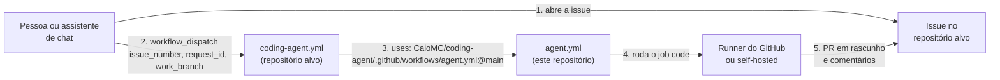
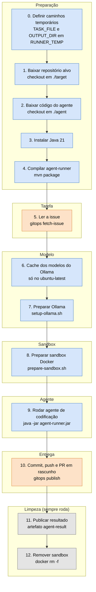
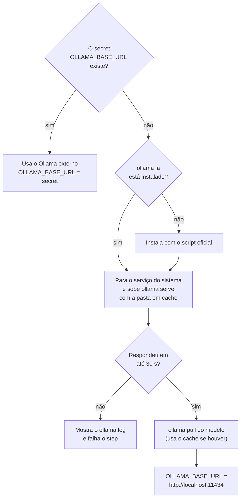
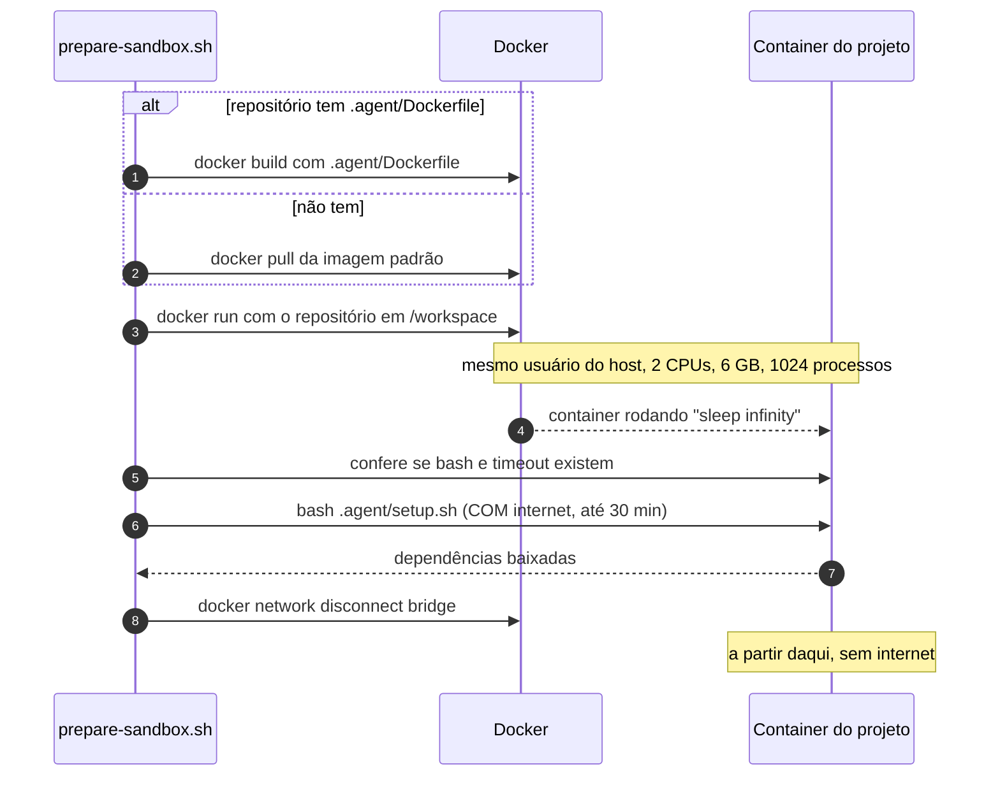
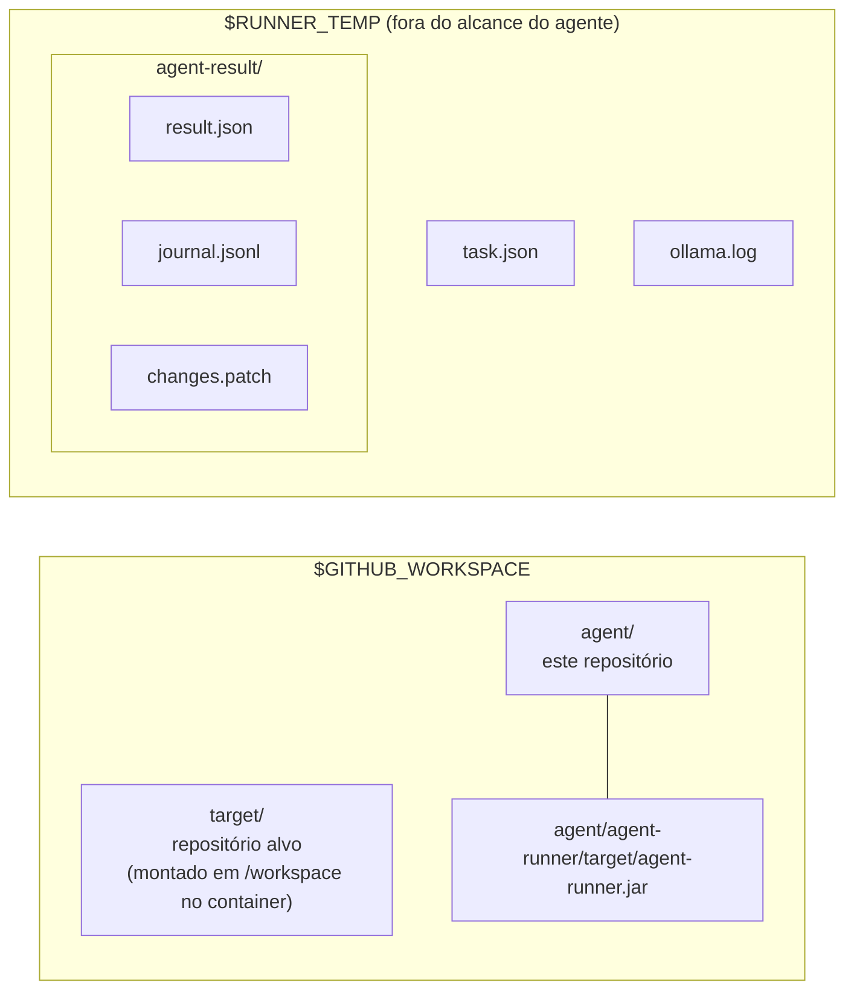

# A pipeline, passo a passo

Aqui eu explico o que acontece desde o momento em que alguém pede uma tarefa até o PR em
rascunho aparecer. Se você só quer a visão geral, leia as seções 1 e 2. Se quer entender
um step específico, pule direto para a seção 4.

## Índice

1. [Quem chama quem](#1-quem-chama-quem)
2. [O diagrama da execução](#2-o-diagrama-da-execução)
3. [Resumo de todos os steps](#3-resumo-de-todos-os-steps)
4. [Cada step em detalhe](#4-cada-step-em-detalhe)
5. [Onde cada arquivo fica no runner](#5-onde-cada-arquivo-fica-no-runner)
6. [O que acontece quando um step falha](#6-o-que-acontece-quando-um-step-falha)

## 1. Quem chama quem

Eu separei a pipeline em **dois workflows**. O motivo: quero que qualquer repositório use o
agente copiando só um arquivo pequeno, sem duplicar a lógica.

- `templates/target-repo/.github/workflows/coding-agent.yml` é o **gatilho**. Ele fica no
  repositório onde o código vai ser alterado (o "repositório alvo") e só recebe os parâmetros.
- `.github/workflows/agent.yml` é o **workflow reutilizável** (`workflow_call`). Ele mora
  neste repositório e tem todos os steps.



O detalhe mais importante: **o workflow reutilizável roda no contexto de quem o chamou**.
Então o `GITHUB_TOKEN` que ele recebe é do repositório alvo, vale só para ele e expira no fim
do job. Por isso eu não preciso de nenhum token pessoal para fazer push e abrir PR.

## 2. O diagrama da execução

Este é o job `code` inteiro. As cores mostram onde o token de escrita do GitHub aparece:

- **laranja**: steps que recebem o `GITHUB_TOKEN`;
- **azul**: steps que rodam sem nenhum token;
- **cinza**: steps de limpeza, que rodam mesmo se algo antes falhar (`if: always()`).



Repare que o step 9, onde o modelo trabalha, fica **entre** os dois steps com token, mas não
recebe o token. É a principal barreira de segurança da pipeline.

## 3. Resumo de todos os steps

| # | Step | O que faz | Como faz | Token? |
|---|---|---|---|---|
| 0 | Definir caminhos temporários | Decide onde ficam `task.json` e a pasta de resultado | Escreve `TASK_FILE` e `OUTPUT_DIR` em `$GITHUB_ENV` | Não |
| 1 | Baixar repositório alvo | Traz o código que o agente vai alterar | `actions/checkout` em `./target`, sem guardar credenciais | Não |
| 2 | Baixar código do agente | Traz este repositório | `actions/checkout` de `agent_repository@agent_ref` em `./agent` | Não |
| 3 | Instalar Java 21 | Prepara o Java para compilar o agente | `actions/setup-java` com cache do Maven | Não |
| 4 | Compilar agent-runner | Gera `agent-runner.jar` | `mvn package -DskipTests` | Não |
| 5 | Ler a issue | Transforma a issue em `task.json` e avisa na issue que começou | `python3 scripts/gitops fetch-issue` | **Sim** |
| 6 | Cache dos modelos | Evita baixar o modelo de novo a cada execução | `actions/cache` em `~/.ollama/models` | Não |
| 7 | Preparar Ollama | Garante um Ollama respondendo | `scripts/setup-ollama.sh` | Não |
| 8 | Preparar sandbox | Sobe o container do projeto, instala dependências e corta a rede | `scripts/prepare-sandbox.sh` | Não |
| 9 | Rodar agente | O laço pensa, age e observa até terminar | `java -jar agent-runner.jar` | **Não** |
| 10 | Commit, push e PR | Publica a branch e abre o PR em rascunho | `python3 scripts/gitops publish` | **Sim** |
| 11 | Publicar resultado | Guarda `result.json`, `journal.jsonl` e `changes.patch` | `actions/upload-artifact`, `if: always()` | Não |
| 12 | Remover sandbox | Apaga o container | `docker rm -f`, `if: always()` | Não |

## 4. Cada step em detalhe

### Step 0: Definir caminhos temporários

**O que:** define `TASK_FILE=$RUNNER_TEMP/task.json` e `OUTPUT_DIR=$RUNNER_TEMP/agent-result`.

**Como:** escreve as duas variáveis em `$GITHUB_ENV`. Tudo o que vai para esse arquivo vira
variável de ambiente nos steps seguintes.

**Por que assim:** eu tentei primeiro colocar `${{ runner.temp }}` no `env:` do job, e o
GitHub recusou o workflow inteiro com `Unrecognized named-value: 'runner'`. O contexto `runner`
só existe **dentro** dos steps. Usar a pasta temporária do runner, e não o workspace, deixa
esses arquivos fora do repositório que o agente enxerga.

### Step 1: Baixar repositório alvo

**O que:** faz o checkout da `base_branch` em `./target`, com os últimos 50 commits.

**Como:** `actions/checkout@v4` com `persist-credentials: false`.

**Por que assim:** sem `persist-credentials: false`, o checkout grava o token dentro do
`.git/config`. Como o agente tem acesso aos arquivos de `./target`, ele poderia ler o token.
Com essa opção, o token nunca encosta no disco.

### Step 2: Baixar código do agente

**O que:** baixa este repositório em `./agent`.

**Como:** `actions/checkout@v4` com `repository: inputs.agent_repository` e `ref: inputs.agent_ref`.
Os padrões são `CaioMC/coding-agent` e `main`.

**Por que assim:** o repositório alvo escolhe a versão do agente. Se um dia eu publicar uma
tag `v1`, basta o alvo passar `agent_ref: v1` para ficar preso a ela.

### Steps 3 e 4: Instalar Java e compilar

**O que:** instala o Java 21 e gera `agent/agent-runner/target/agent-runner.jar`.

**Como:** `actions/setup-java@v4` com `cache: maven` e depois `mvn -B -q package -DskipTests`.

**Por que assim:** compilar a cada execução custa cerca de um minuto, mas deixa a POC simples.
O próximo passo natural é publicar uma imagem pronta no GHCR.

### Step 5: Ler a issue

**O que:** lê a issue, grava `task.json` e comenta na issue com o link da execução.

**Como:** `python3 scripts/gitops fetch-issue`. O script chama `GET /repos/{repo}/issues/{n}`,
extrai os critérios de aceite (linhas `- [ ] ...` do corpo) e grava o JSON. Os detalhes estão
em [gitops-python.md](gitops-python.md).

**Por que assim:** **a issue é a tarefa**. Quem pede o trabalho escreve em linguagem natural,
e as caixinhas de seleção viram critérios objetivos que o agente recebe no prompt.

Exemplo de `task.json`:

```json
{
  "requestId": "7d2f1fe2",
  "issueNumber": 6,
  "issueUrl": "https://github.com/CaioMC/poc-websocket-demo/issues/6",
  "title": "Adicione um log.info(\"ola\")",
  "description": "Corpo da issue...\n- [ ] compila",
  "acceptanceCriteria": ["compila"]
}
```

### Step 6: Cache dos modelos do Ollama

**O que:** restaura e salva `~/.ollama/models` entre execuções.

**Como:** `actions/cache@v4` com a chave `ollama-<modelo>`. Só roda quando `runner` é
`ubuntu-latest`, porque num runner self-hosted os modelos já ficam na máquina.

### Step 7: Preparar Ollama

**O que:** garante que existe um Ollama respondendo e exporta `OLLAMA_BASE_URL`.

**Como:** `scripts/setup-ollama.sh` decide entre dois caminhos:



**Por que assim:** eu queria que a POC rodasse sem nenhuma infraestrutura, então o padrão é
instalar o Ollama no próprio runner. O problema é que o `ubuntu-latest` não tem GPU: cada
resposta do modelo pode levar minutos. Para uso real, configure o secret com um servidor que
tenha GPU (mais em [README.md](../README.md#6-onde-o-modelo-roda)).

### Step 8: Preparar sandbox Docker

**O que:** cria o container onde **todo comando do agente** vai rodar.

**Como:** `scripts/prepare-sandbox.sh`:



**Por que assim:** o agente precisa compilar e testar o projeto, mas o código que ele escreve
não é confiável. Então as dependências são baixadas **antes** (com rede) e a rede é cortada
**antes** do modelo começar. O repositório é montado como volume: o que o agente edita fora do
container aparece dentro, e vice-versa. Usar o mesmo usuário do host garante que os arquivos
criados no container continuem editáveis e "commitáveis" fora dele.

### Step 9: Rodar agente de codificação

**O que:** roda o laço do agente até ele chamar `finish` ou atingir um limite. Depois roda
a verificação independente (`.agent/verify.sh`) e grava `result.json` e `journal.jsonl`.

**Como:** `java -jar agent-runner.jar`, configurado por variáveis `AGENT_*`:

| Variável | Valor na pipeline |
|---|---|
| `AGENT_WORKSPACE` | `./target` |
| `AGENT_TASK_FILE` | `$RUNNER_TEMP/task.json` |
| `AGENT_OUTPUT_DIR` | `$RUNNER_TEMP/agent-result` |
| `AGENT_EXECUTOR` | `docker` |
| `AGENT_CONTAINER` | `agent-sandbox-<run_id>` |
| `AGENT_MAX_ITERATIONS` | input `max_iterations` (padrão 30) |
| `OLLAMA_MODEL` | input `model` (padrão `qwen3:4b`) |

**Por que assim:** este step é o único que fala com o modelo, e é o único que **não** recebe
o `GITHUB_TOKEN`. Mesmo que o modelo fosse convencido a tentar um `git push`, não haveria
credencial para isso. O funcionamento interno do laço está em
[sequencias.md](sequencias.md) e [estados.md](estados.md).

**Código de saída:** `0` sempre que o agente rodou, mesmo sem concluir a tarefa; `1` só quando
o laço quebrou (status `ERROR`, por exemplo com o modelo fora do ar).

### Step 10: Commit, push e PR em rascunho

**O que:** publica o trabalho do agente.

**Como:** `python3 scripts/gitops publish`. Ele faz `git add` (ignorando `target/`, `build/`,
`node_modules/` e `.gradle/`), guarda o diff em `changes.patch`, faz commit, push da
`work_branch` e abre o PR em rascunho com `Closes #N`. No fim, comenta na issue.

**Por que assim:** o token de escrita aparece só aqui e no step 5, em scripts pequenos que eu
consigo ler inteiros. Os caminhos possíveis (sem alterações, PR com `[WIP]`, sem PR) estão em
[estados.md](estados.md#7-publicação-publishcommand).

> **Atenção:** o GitHub bloqueia, por padrão, que o `GITHUB_TOKEN` abra PRs. Se aparecer
> `HTTP 403 ... GitHub Actions is not permitted to create or approve pull requests`, habilite
> *Settings → Actions → General → Allow GitHub Actions to create and approve pull requests*
> no repositório alvo.

### Steps 11 e 12: Publicar resultado e remover sandbox

**O que:** sobe a pasta `agent-result` como artefato e apaga o container.

**Como:** `actions/upload-artifact@v4` e `docker rm -f`, os dois com `if: always()`.

**Por que assim:** mesmo quando algo falha, eu quero o `journal.jsonl` para entender o que
aconteceu, e não quero um container órfão num runner self-hosted.

O artefato `agent-result` contém:

| Arquivo | Quem gera | Conteúdo |
|---|---|---|
| `result.json` | agent-runner, completado pelo `publish` | status, resumo, iterações, verificação, PR |
| `journal.jsonl` | agent-runner | uma linha JSON por evento: turno do modelo, ferramenta, comando |
| `changes.patch` | `publish` | o diff do que o agente mudou (quando mudou algo) |

## 5. Onde cada arquivo fica no runner



## 6. O que acontece quando um step falha

No GitHub Actions, quando um step falha, os seguintes são **pulados**, exceto os que têm
`if: always()`. Na prática:

| Falhou em | O que já aconteceu | O que você vê |
|---|---|---|
| Parsing do workflow (antes de tudo) | Nada | `HTTP 422` no dispatch. Rode o `actionlint` |
| Steps 1 a 4 | Nada visível | Job vermelho, sem comentário na issue |
| Step 5 | Pode não ter comentado | Job vermelho. Confira permissões de `issues: write` |
| Steps 7 ou 8 | Issue comentada com "comecei" | Job vermelho, artefato vazio |
| Step 9 (`ERROR`) | Issue comentada, `result.json` com `ERROR` | Job vermelho, **sem** comentário final na issue |
| Step 10 (PR 403) | Branch já está no GitHub | Job vermelho. Abra o PR à mão e ajuste a permissão |

A tabela mostra uma limitação que eu ainda quero resolver: quando o agente termina com
`ERROR`, a issue fica só com o comentário "comecei". Hoje o jeito de saber o motivo é abrir o
artefato `agent-result`.
