# Diagramas de sequência

Um diagrama de sequência mostra **quem conversa com quem, e em que ordem**. Eu separei um
diagrama por caso, em vez de um diagrama gigante com todos os `alt`, porque assim fica fácil
achar o cenário que você está investigando.

Os nomes dos participantes são os nomes reais das classes e scripts. Quando um participante é
uma porta (interface) da arquitetura, eu uso o nome da implementação que roda na pipeline:
por exemplo, `DockerCommandExecutor` no lugar de `CommandExecutor`.

## Índice

**Do início ao fim**
1. [Disparo e leitura da issue](#1-disparo-e-leitura-da-issue)
2. [A execução completa do agent-runner](#2-a-execução-completa-do-agent-runner)

**Dentro do laço do agente**
3. [Uma iteração com ferramenta](#3-uma-iteração-com-ferramenta)
4. [O modelo chama finish](#4-o-modelo-chama-finish)
5. [Ferramenta devolve erro e o modelo corrige](#5-ferramenta-devolve-erro-e-o-modelo-corrige)
6. [Comando bloqueado pela política](#6-comando-bloqueado-pela-política)
7. [Tentativa de sair do repositório](#7-tentativa-de-sair-do-repositório)
8. [Modelo responde sem ferramenta](#8-modelo-responde-sem-ferramenta)
9. [Limite de chamadas de ferramenta](#9-limite-de-chamadas-de-ferramenta)
10. [Limite de iterações](#10-limite-de-iterações)
11. [Falha do modelo](#11-falha-do-modelo)

**Depois do laço**
12. [Verificação independente](#12-verificação-independente)
13. [Publicação com PR](#13-publicação-com-pr)
14. [Publicação sem alterações](#14-publicação-sem-alterações)
15. [Publicação sem PR (status ERROR)](#15-publicação-sem-pr-status-error)
16. [Falha ao abrir o PR (HTTP 403)](#16-falha-ao-abrir-o-pr-http-403)

---

## 1. Disparo e leitura da issue

Quem abre a issue pode ser uma pessoa ou o assistente de chat. O disparo usa o
`workflow_dispatch` do repositório alvo.

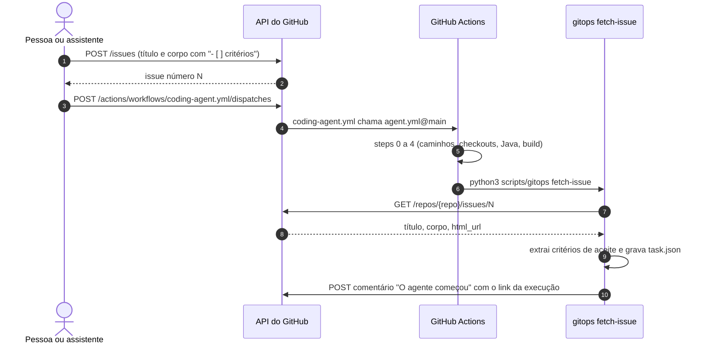

## 2. A execução completa do agent-runner

Esta é a visão da orquestração. O `RunCodingAgentUseCase` não sabe nada de Spring AI, Docker
ou JSON: ele só conversa com portas.

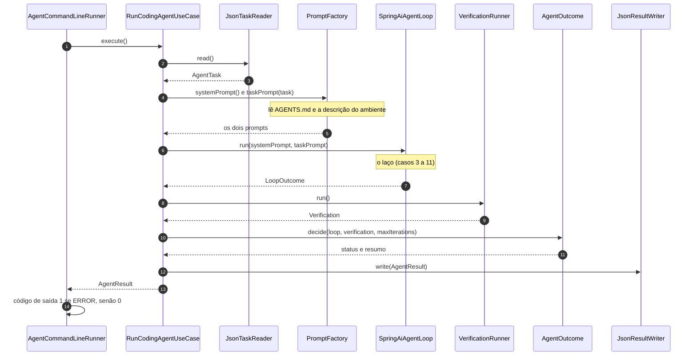

## 3. Uma iteração com ferramenta

É o coração do agente: **pensa, age, observa**. O modelo nunca executa nada. Ele pede, e o
agent-runner executa no container e devolve o código de saída e o final da saída.

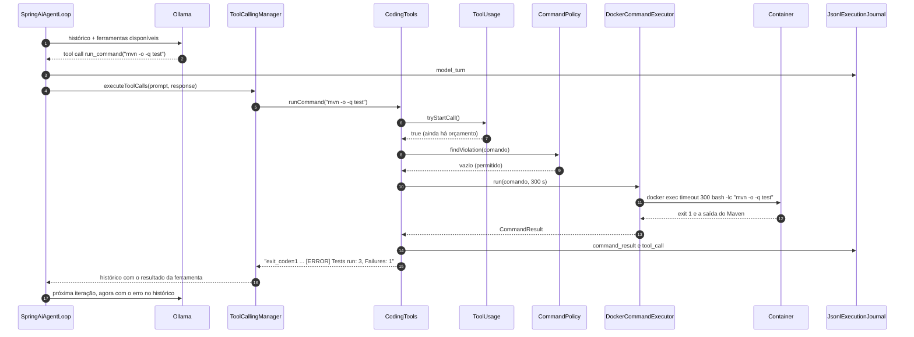

Na próxima volta, o modelo lê `exit_code=1` e o teste que falhou, e decide o que fazer: ler o
arquivo, corrigir com `replace_in_file` e rodar o teste de novo.

## 4. O modelo chama finish

`finish` é uma ferramenta com `returnDirect = true`. Ao ser chamada, ela registra o
`FinishSignal`, e o laço vê o sinal e para.

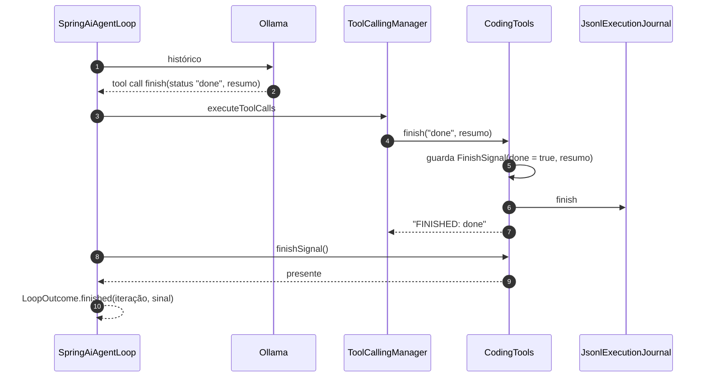

## 5. Ferramenta devolve erro e o modelo corrige

Erros das ferramentas **não derrubam o agente**. Eles viram texto (`ERRO: ...`) que o modelo lê.

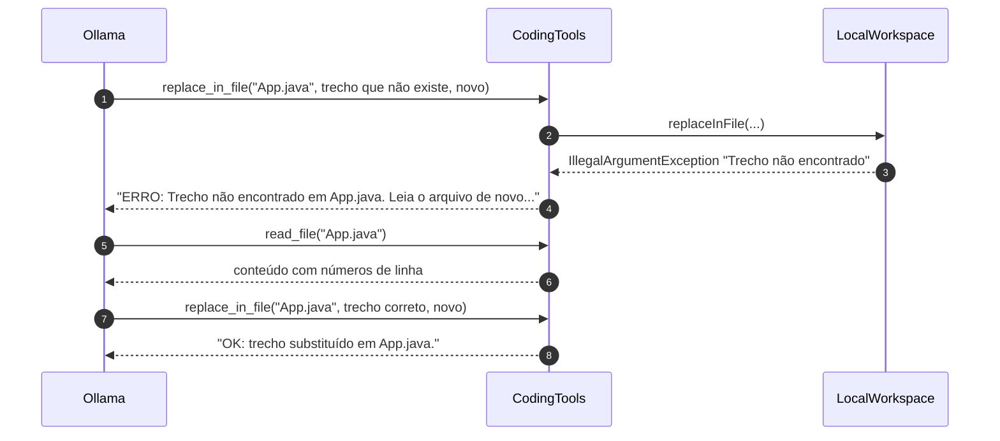

Outro erro comum é o trecho aparecer mais de uma vez. A mensagem pede mais contexto para
tornar o trecho único. Essa regra evita edições ambíguas.

## 6. Comando bloqueado pela política

A `CommandPolicy` não é a barreira principal (essa é o container sem rede e sem token). Ela
existe para dar ao modelo uma resposta **clara** quando ele tenta fazer o papel da pipeline.

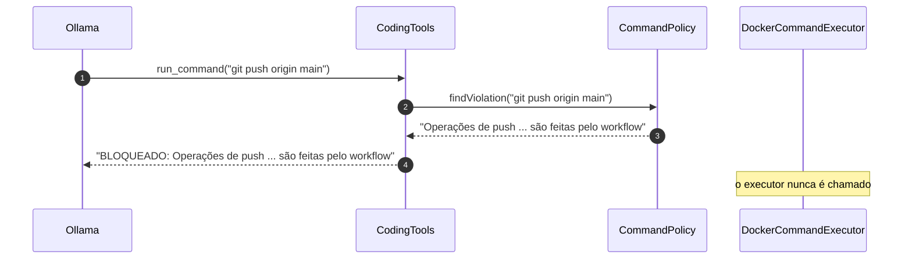

Comandos bloqueados: `git push|remote|config --global|credential`,
`git commit|checkout -b|switch -c|reset --hard|rebase`, `sudo`, `rm -rf /`, `rm -rf ~` e
comandos de sistema como `shutdown` e `mkfs`.

## 7. Tentativa de sair do repositório

Todo caminho que vem do modelo passa pelo `SafePathResolver`.

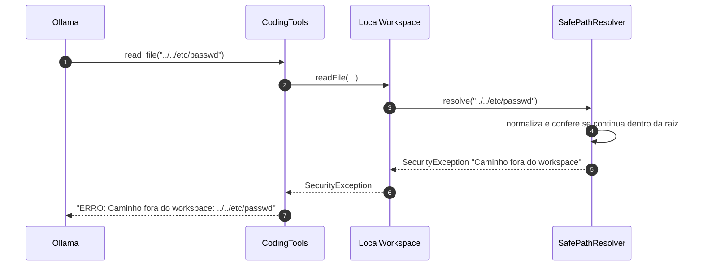

O mesmo acontece com um link simbólico que aponta para fora e com qualquer caminho dentro de
`.git/`.

## 8. Modelo responde sem ferramenta

Modelos pequenos às vezes respondem só com texto ("vou analisar o projeto..."). Eu dou
**dois lembretes** antes de desistir.

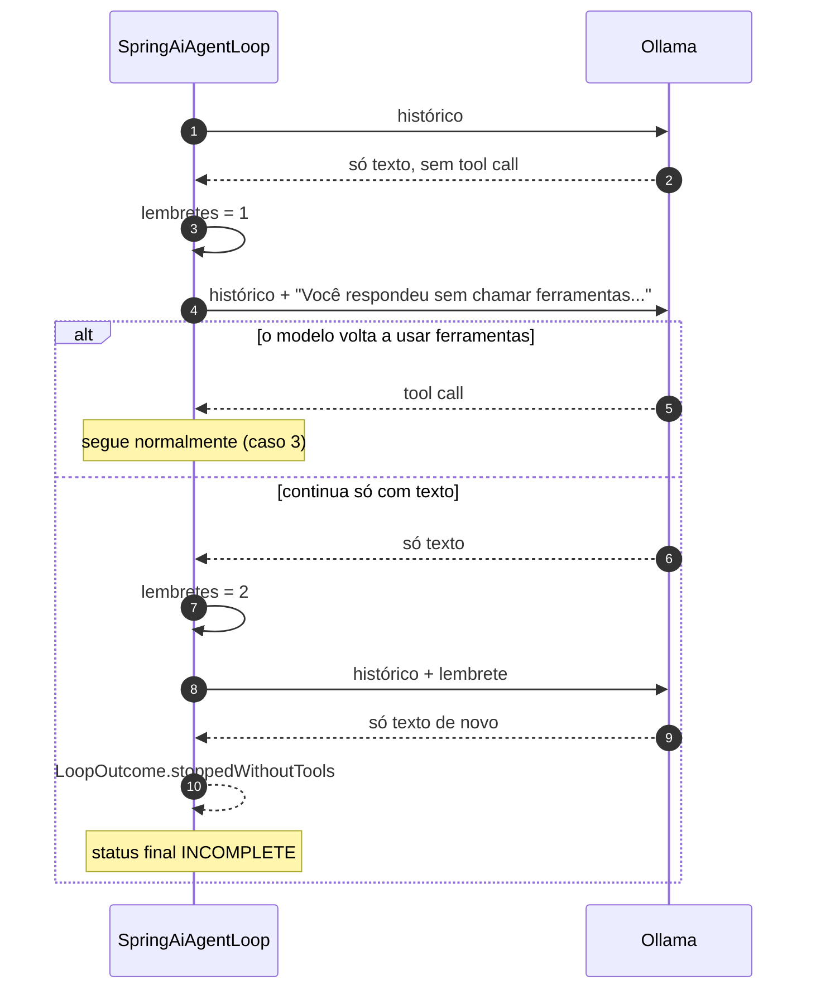

## 9. Limite de chamadas de ferramenta

Além do limite de iterações, existe um limite de **chamadas de ferramenta** (padrão 90),
porque o modelo pode pedir várias ferramentas numa mesma iteração.

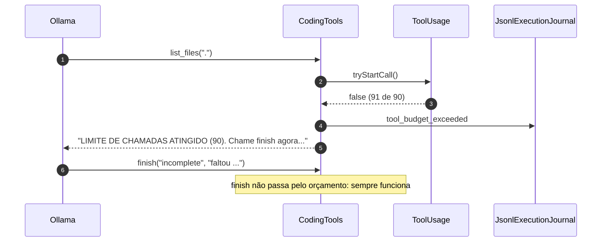

## 10. Limite de iterações

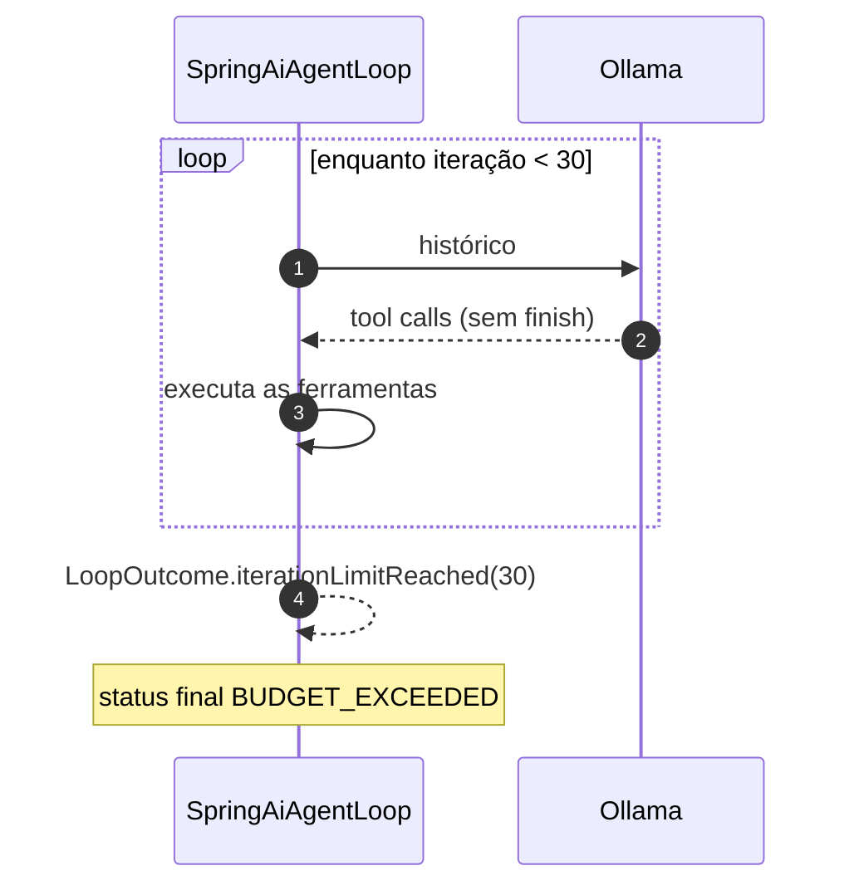

## 11. Falha do modelo

Se a chamada ao modelo lança uma exceção (Ollama fora do ar, timeout, resposta inválida), o
laço registra o erro e devolve `ERROR`. A verificação **roda mesmo assim**, porque o agente
pode ter deixado arquivos alterados.

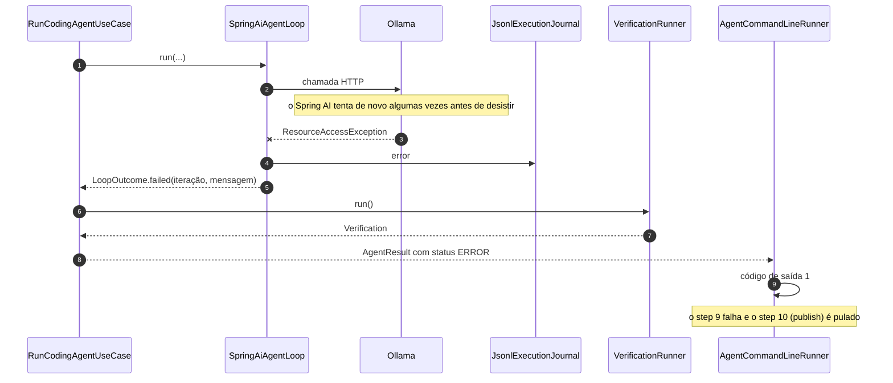

## 12. Verificação independente

Depois do laço, eu **não confio** no que o modelo disse. O `VerificationRunner` roda o
`.agent/verify.sh` do repositório alvo, e esse resultado vai para a descrição do PR.

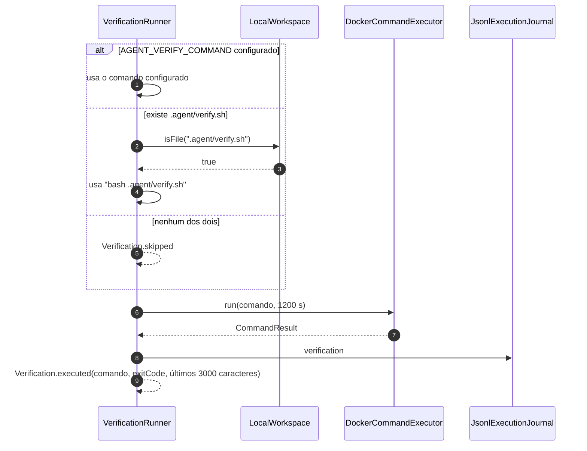

## 13. Publicação com PR

O caminho feliz do step 10.

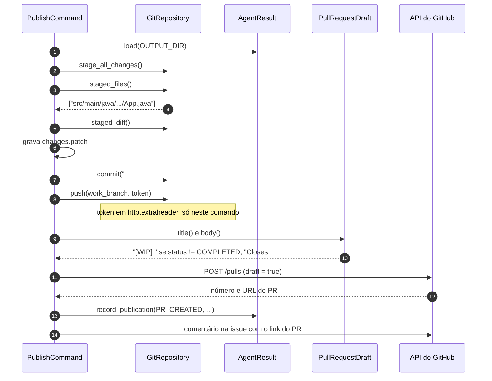

## 14. Publicação sem alterações

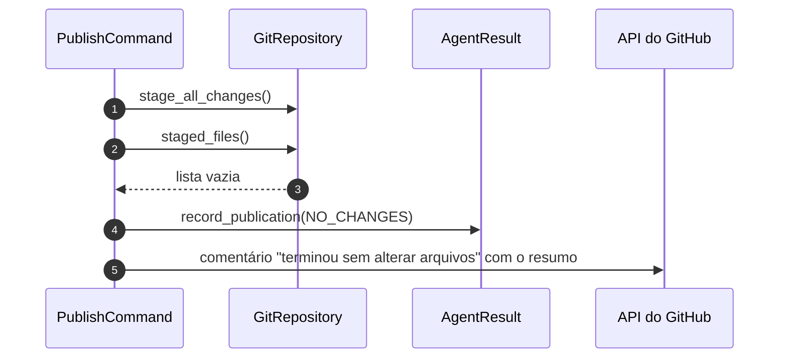

## 15. Publicação sem PR (status ERROR)

É uma proteção: se o `result.json` diz `ERROR` (ou nem existe), eu guardo o diff mas não
abro PR. O mesmo vale para qualquer status diferente de `COMPLETED` quando
`OPEN_PR_ON_FAILURE=false`.

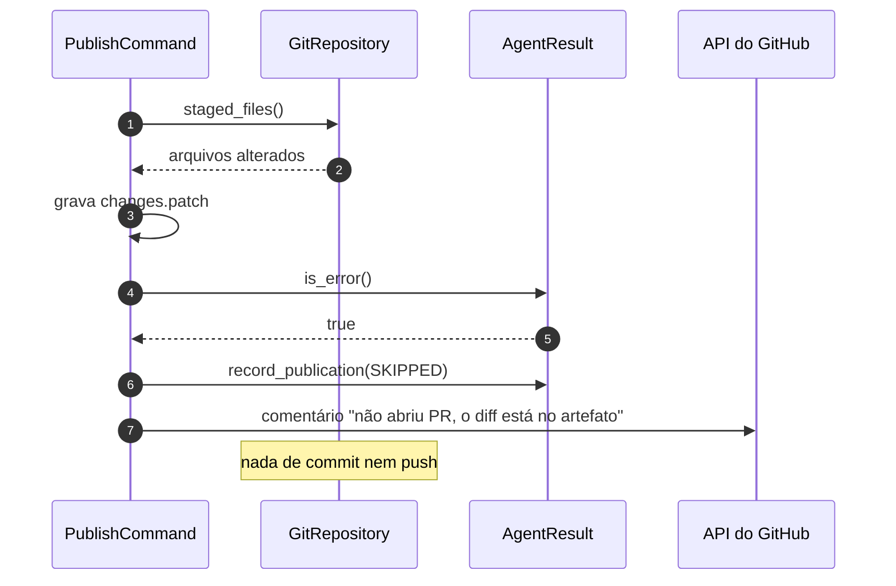

## 16. Falha ao abrir o PR (HTTP 403)

Aconteceu comigo na primeira execução real. O push funciona, mas a criação do PR é recusada
porque o repositório não permite que o `GITHUB_TOKEN` abra PRs.

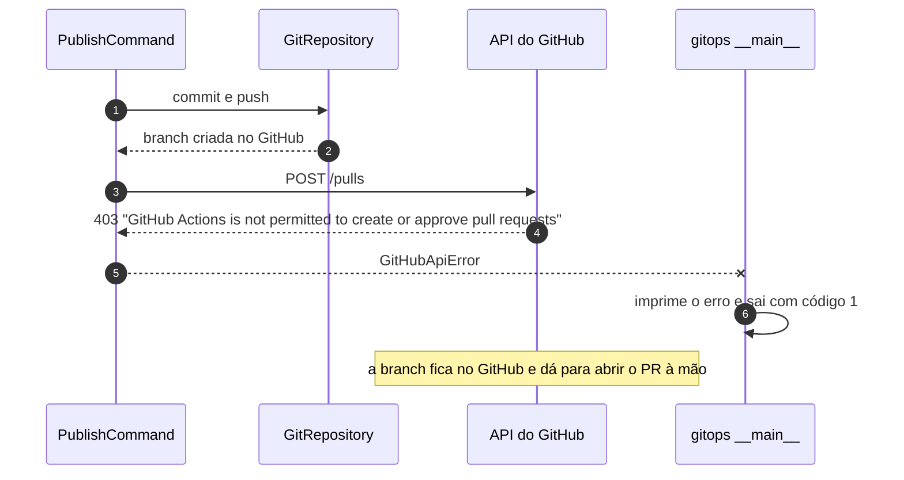

Como resolver: *Settings → Actions → General → Workflow permissions → Allow GitHub Actions to
create and approve pull requests*, no repositório alvo.
